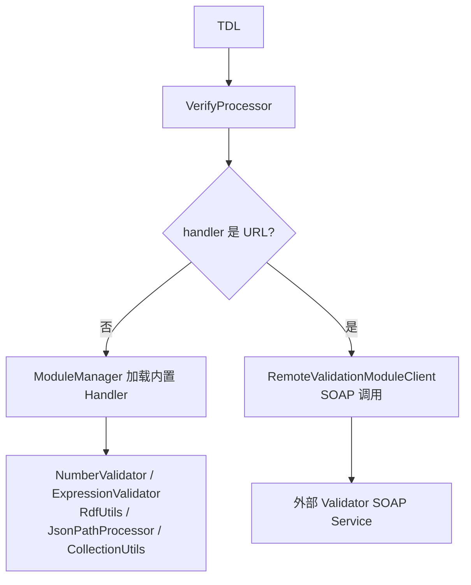
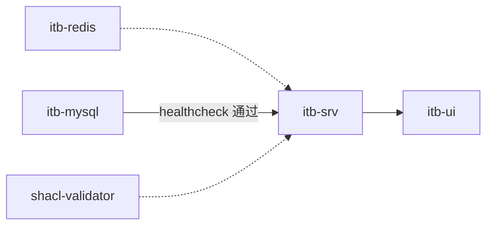
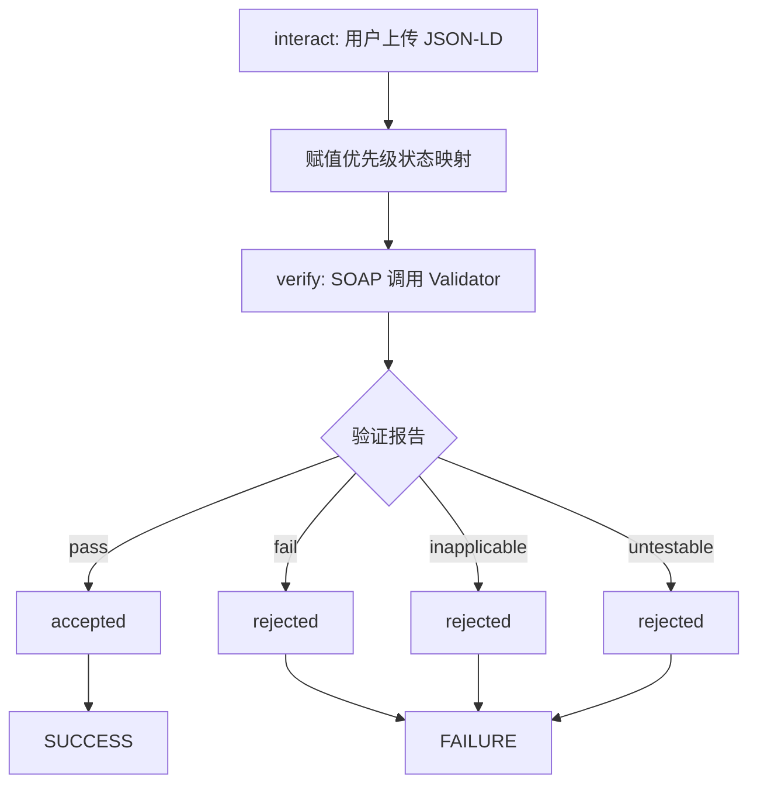
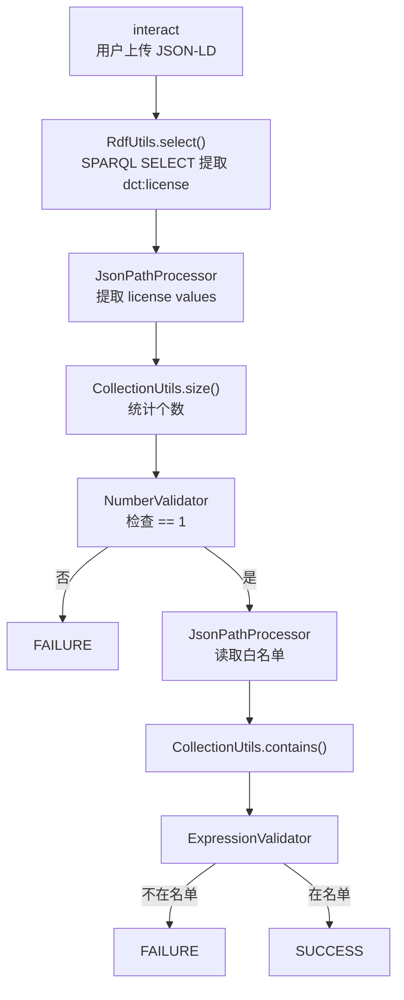
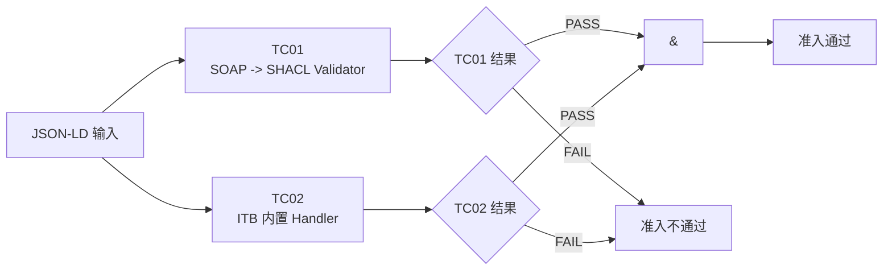
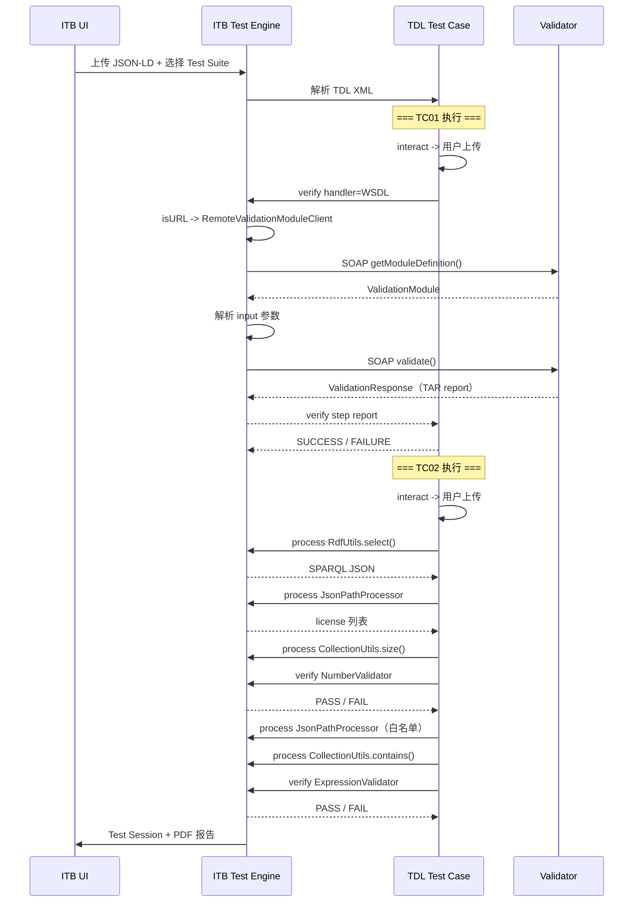

# D 组 ITB 源码分析报告

## 1. 整体框架



D 组使用了两种验证路径：

| Test Case | handler | 调用方式 | 验证内容 |
|-----------|---------|----------|----------|
| TC01 | SOAP WSDL URL | RemoteValidationModuleClient | SHACL 字段规则检查 |
| TC02 | ITB 内置组件名 | ModuleManager 加载 | 许可证数量 + 白名单 |

---

## 2. ITB 部署拓扑

项目使用 Docker Compose 部署 ITB，源码路径：

```text
testbed/docker-compose.yml
```

```yaml
services:
  gitb-redis:                      # 缓存和会话管理
    image: isaitb/gitb-redis
  gitb-mysql:                      # 持久化存储
    image: isaitb/gitb-mysql
    volumes:
      - gitb-dbdata:/var/lib/mysql
  gitb-srv:                        # ITB 后端服务（Test Engine）
    image: isaitb/gitb-srv
    ports:
      - "8080:8080"
    environment:
      CALLBACK_ROOT_URL: http://localhost:8080/itbsrv
    depends_on:
      gitb-mysql:    condition: service_healthy
      gitb-redis:    condition: service_started
      shacl-validator: condition: service_started
  gitb-ui:                         # ITB 管理界面
    image: isaitb/gitb-ui
    ports:
      - "9000:9000"
```

容器依赖链：



ITB 后端与 Validator 通过网络通信：

```text
itb-srv ----SOAP----> shacl-validator:8080/shacl/soap/energy/validation?wsdl
```

Validator 的配置以只读卷挂载，TTL 规则可在不重建镜像的情况下更新：

```yaml
services:
  shacl-validator:
    volumes:
      - ../validator-config:/validator/resources:ro
```

### 2.1 数据卷补充

```yaml
volumes:
  gitb-repo:      # ITB 文件仓库：存储上传的 Test Suite、附件、报告文件
  gitb-dbdata:    # MySQL 数据持久化：Domain、Specification、Test Session 等
```

`gitb-repo` 卷的内容包括 Test Suite ZIP 中的资源文件（如 `building-energy-shapes_D.ttl`）和每个 Test Session 的输入输出文件。`gitb-dbdata` 保存 MySQL 中的业务数据。

**不要对运行中的 ITB 执行 `docker compose down -v`**，因为 `-v` 会删除这两个数据卷，导致 Domain、Specification、Test Suite 和历史报告全部丢失。

### 2.2 shacl-validator 只读卷挂载

`:ro` 表示只读挂载。validator 的 SHACL shapes 和 domain 配置不打包进 Docker 镜像，而是通过卷在启动时注入：
- 更新 SHACL 规则不需要重建 validator 镜像
- 容器内 validator 进程对 `/validator/resources/` 只有读权限
- ITB 后端通过 `http://shacl-validator:8080/...` 走 Docker 内部网络调用 validator 的 SOAP 接口，不经过宿主机端口映射

---

## 3. TC01 的 TDL 源码分析

源码路径：

```text
testsuite/testCases/TC01_METADATA_FIELD_VALIDATION.xml
```

Test Case 引用了 SHACL 规则资源：

```xml
<imports>
    <artifact name="energyShapes">Resources/building-energy-shapes_D.ttl</artifact>
</imports>
```

定义了三个 Actor：

```xml
<actors>
    <actor id="Provider" name="Energy Data Provider" role="SUT"/>
    <actor id="Authority" name="City Energy Data Space Authority" role="SIMULATED"/>
    <actor id="Validator" name="ITB Validation Engine" role="SIMULATED"/>
</actors>
```

用户交互步骤，上传 JSON-LD：

```xml
<interact id="userData" desc="Upload building energy metadata for SHACL validation">
    <request name="metadata" inputType="UPLOAD" mimeType="application/ld+json" required="true"/>
</interact>
```

核心验证步骤——SOAP 调用外部 Validator：

```xml
<verify id="validateMetadataWithSoapShaclValidator"
        handler="http://shacl-validator:8080/shacl/soap/energy/validation?wsdl"
        desc="Validate uploaded metadata with the official SHACL Validator SOAP API">
    <input name="contentToValidate">$userData{metadata}</input>
    <input name="contentSyntax">"application/ld+json"</input>
    <input name="validationType">"v1"</input>
</verify>
```

关键点：

- handler 是一个完整的 WSDL URL 而非组件名，这触发 ITB 走远程调用路径
- contentSyntax 固定为 "application/ld+json"，向 Validator 声明输入数据的 RDF 序列化格式
- validationType 为 "v1"，与 energy 域配置文件中定义的验证类型对应

TC01 的 TDL 逻辑：



---

## 4. TC02 的 TDL 源码分析

源码路径：

```text
testsuite/testCases/TC02_LICENSE_POLICY_VALIDATION.xml
```

TC02 使用 ITB 内置 Handler，不调用外部 Validator。使用 stopOnError=true，任一步骤失败则中止。

SPARQL 查询提取 dct:license：

```xml
<process id="queryLicense"
         output="licenseQueryResult"
         handler="RdfUtils" operation="select"
         desc="Extract dct:license from metadata">
    <input name="model">$metadataText</input>
    <input name="inputContentType">"application/ld+json"</input>
    <input name="outputContentType">"application/sparql-results+json"</input>
    <input name="query">$licenseQuery</input>
</process>
```

JsonPathProcessor 从 SPARQL JSON 结果提取 license URI 列表：

```xml
<process id="extractLicenseValues"
         output="licenseValues"
         handler="JsonPathProcessor" operation="process"
         desc="Read licence values from the SPARQL result">
    <input name="content">$licenseQueryResult</input>
    <input name="expression">"$.results.bindings[*].license.value"</input>
    <input name="outputType">"list"</input>
</process>
```

NumberValidator 验证必须恰好一个 license：

```xml
<verify id="checkLicenseCount"
        handler="NumberValidator"
        desc="Check that exactly one IRI-valued licence is declared">
    <input name="actual">$licenseCount</input>
    <input name="expected">1</input>
</verify>
```

读取白名单 JSON：

```xml
<process id="readLicenseWhitelist" output="allowedLicenses"
         handler="JsonPathProcessor" operation="process">
    <input name="content">$licenseWhitelistText</input>
    <input name="expression">"$.allowedLicenses[*]"</input>
    <input name="outputType">"list"</input>
</process>
```

大小写敏感的精确白名单匹配：

```xml
<process id="checkWhitelistMembership" output="licenseAllowed"
         handler="CollectionUtils" operation="contains">
    <input name="list">$allowedLicenses</input>
    <input name="value">$license</input>
    <input name="ignoreCase">false()</input>
</process>

<verify id="validateLicensePolicy" handler="ExpressionValidator">
    <input name="expression">$licenseAllowed</input>
</verify>
```

TC02 的完整执行流水线：



TC02 使用的 ITB 内置 Handler：

| Handler | 功能 | 对应 ITB Java 模块 |
|---------|------|-------------------|
| RdfUtils | 解析 RDF，执行 SPARQL 查询 | gitb-handlers |
| JsonPathProcessor | 从 JSON 结构中提取值 | gitb-handlers |
| CollectionUtils | 集合操作（size、contains） | gitb-handlers |
| NumberValidator | 数值断言 | gitb-handlers |
| ExpressionValidator | 布尔表达式断言 | gitb-handlers |

---

## 5. ITB 的验证执行机制

### 5.0 ModuleManager 内置 Handler 注册机制

ITB 内置 Handler 由 `ModuleManager` 在启动时扫描 classpath 注册别名：

```text
gitb-core/src/main/java/com/gitb/validation/ModuleManager.java

ModuleManager.getInstance()
    .registerValidationHandler("NumberValidator", new NumberValidator());
    .registerValidationHandler("ExpressionValidator", new ExpressionValidator());
    .registerValidationHandler("RdfUtils", new RdfUtils());
    .registerValidationHandler("JsonPathProcessor", new JsonPathProcessor());
    .registerValidationHandler("CollectionUtils", new CollectionUtils());
```

TDL 中写 `<verify handler="NumberValidator">` 时，`VerifyProcessor` 调用 `ModuleManager.getValidationHandler("NumberValidator")`，找到本地实例直接执行，**不走 SOAP 调用**。这是 TC02 比 TC01 快的原因——所有操作都在 ITB 进程内完成。

### 5.1 Handler 路由

ITB 的 VerifyProcessor 根据 handler 属性值做路由：

```text
<verify handler="NumberValidator">       -> ModuleManager 寻找本地 Handler
<verify handler="http://.../validation"> -> RemoteValidationModuleClient
```

本地 Handler 通过 IValidationHandler 接口加载：

```java
// ITB 源码（gitb-core）
public interface IValidationHandler {
    ValidationModule getModuleDefinition();
    TestStepReportType validate(...);
}
```

远程 Handler 的客户端实现：

```text
gitb-remote/.../RemoteValidationModuleClient.java implements IValidationHandler
```

### 5.2 数据转换

远程调用前，ITB 将内部 DataType 转换为 GITB AnyContent，外部 Validator 返回的 ValidationResponse 中的 TAR 被转换回 TestStepReportType。

### 5.3 验证矩阵

两路独立验证，都在 PASS 时准入通过：



---

## 6. 端到端执行流程



---

## 7. TDL 步骤类型全览

`ITB_Validator源码解析.md` 只分析了 `<verify>` 步骤的 VerifyProcessor 路由逻辑。但完整的 TDL Test Case 包含 **6 种步骤类型**，ITB 的 `gitb-engine` 用不同的 Processor 处理每种：

| TDL 步骤 | ITB Processor | 作用 | D 组用例 |
|----------|---------------|------|----------|
| `<interact>` | `InteractStepProcessor` | 等待用户上传文件或填写输入 | TC01/TC02 接收 JSON-LD |
| `<assign>` | `VariableProcessor` | 赋值、类型转换、构造变量 | 优先级映射、空白值归一化标记 |
| `<process>` | `ProcessProcessor` | 调用 Handler 处理数据 | RdfUtils SPARQL、JsonPathProcessor 提取值 |
| `<verify>` | `VerifyProcessor` | 执行验证并生成报告 | SOAP 调用 Validator / NumberValidator 断言 |
| `<send>` | `SendProcessor` | 通过 Messaging Handler 发送消息 | TC03 调用 Provider API（HttpMessagingV2） |
| `<output>` | 非 Processor（静态定义） | Test Case 的最终 SUCCESS/FAILURE 消息模板 | 各 TC 的输出定义 |

### 7.1 `<assign>` 的类型系统

TDL 的类型系统由 `gitb-types` 模块的 `DataType` 体系提供，**不是 XML 原生类型**：

```xml
<!-- 字符串隐式赋值 -->
<assign to="metadataStatusPriority">"untestable,fail,inapplicable,pass"</assign>

<!-- 显式类型转换：将二进制上传数据转换为 UTF-8 字符串 -->
<assign to="metadataText" type="string">$userData{metadata}</assign>

<!-- 布尔值 -->
<assign to="metadataOptionalBlankNormalization">true()</assign>
```

`type="string"` 告诉 ITB 把 `DataType` 实例中的二进制内容按 UTF-8 解码为字符串。TC02 中如果没有这行，`$userData{metadata}` 在 ITB 内部是二进制 `DataType`，传给 `RdfUtils` 做 SPARQL 查询前可能解析失败。

### 7.2 `<send>` 的消息模型

TC03使用了 `<send>` 步骤，这是 TC01 和 TC02 都没有的步骤类型：

```xml
<send id="apiRequest"
      from="Gateway"
      to="Provider"
      handler="HttpMessagingV2"
      desc="Call the declared Provider API endpoint">
    <input name="uri">$endpoint</input>
    <input name="method">"GET"</input>
    <input name="followRedirects">false()</input>
    <input name="connectionTimeout">10000</input>
    <input name="requestTimeout">30000</input>
    <input name="version">"1.1"</input>
</send>
```

`<send>` 的 handler 使用 `HttpMessagingV2`，它对应 ITB 的 `gitb-messaging` 模块中的 `HttpMessagingV2Handler`。它与 `<verify>` 的 Handler 是两套不同的接口体系：
- `<verify>` → `IValidationHandler`
- `<send>` → `IMessagingHandler`

返回结果通过 `$apiRequest{response}{status}` 和 `$apiRequest{response}{body}` 引用，由 `SendProcessor` 解析 HTTP 响应后写入变量上下文。

---

## 8. TDL 变量引用系统

ITB 的 `VariableManager`（`gitb-engine`）负责管理 TDL 中所有 `$` 引用的解析：

| 引用格式 | 含义 | 解析时机 | 示例 |
|----------|------|----------|------|
| `$userData{metadata}` | 从 `interact` 步骤获取用户输入 | 步骤执行时 | TC01/TC02 的上传文件 |
| `$energyShapes` | 从 `<imports>` 获取 Test Suite 打包资源 | Suite 导入时预加载 | TC01 的 SHACL 规则 |
| `$metadataText` | 引用 `<assign>` 定义的变量 | 步骤执行时 | TC02 的字符串转换结果 |
| `$STEP_STATUS{checkLicenseCount}` | 引用某步骤的执行状态 | 步骤执行后 | TC02 的 output 条件判断 |
| `$licenseValues{0}` | 列表索引引用 | 步骤执行时 | TC02 取第一个 license |
| `$apiRequest{response}{status}` | 嵌套属性引用（消息响应） | send 步骤后 | TC03 取 HTTP 状态码 |

### 8.1 `<imports>` 的资源加载机制

```xml
<imports>
    <artifact name="energyShapes">Resources/building-energy-shapes_D.ttl</artifact>
</imports>
```

当 ITB 导入 Test Suite ZIP 时，`TestSuiteImporter`（`gitb-testbed-service`）会：
1. 解析 `testSuite.xml` 找到所有引用的 Test Case XML
2. 对每个 Test Case 解析 `<imports>`，发现 `Resources/building-energy-shapes_D.ttl`
3. 从 ZIP 中提取该文件，存入 `gitb-repo` 卷
4. 执行时 `$energyShapes` 解析为该文件的二进制内容

如果 ZIP 结构不对（如多一层嵌套目录），ITB 就找不到 resource 文件，`$energyShapes` 引用解析失败，Test Case 无法执行。

---

## 9. ITB 对象模型

ITB 的核心对象关系在 `gitb-core` 和 `gitb-persistence` 模块中定义：

```text
Domain
 └── Specification
      ├── Actor (SUT / SIMULATED)
      └── TestSuite
           └── TestCase (steps, imports, output)

Organisation
 └── System
      └── ConformanceStatement
           ├── 绑定 Specification
           └── 绑定 Actor (SUT)
                └── TestSession
                     ├── 该 TestCase 的执行记录
                     ├── 每一步的 StepReport
                     └── 最终 ValidationReport（TAR 格式 → PDF）
```

### 9.1 Actor 角色约束

D 组在 testSuite.xml 中定义了 4 个 Actor：

```xml
<gitb:actor id="Provider"  role="SUT"/>
<gitb:actor id="Authority" role="SIMULATED"/>
<gitb:actor id="Validator" role="SIMULATED"/>
<gitb:actor id="Gateway"   role="SIMULATED"/>
```

**只有 `role="SUT"` 的 Actor 可以在 Conformance Statement 中被选为受测对象。** 测试者在创建 Conformance Statement 时只能在 Provider 角色下绑定 System。这是 ITB 权限模型对 TDL actor 声明的映射约束。

### 9.2 Test Session 执行选择逻辑

当测试者在 Conformance Statement 中点击"运行测试"时，ITB 的 `TestSessionManager` 按以下逻辑确定要执行哪些 Test Case：

1. 查找 Conformance Statement 绑定的 Specification + SUT Actor
2. 找到该 Specification 关联的 TestSuite
3. 只选择 `<actors>` 中声明了该 SUT Actor 的 Test Case
4. 跳过 `disabled="true"` 的 Test Case（TC03）
5. 将选中的 Test Case 放入执行队列

---

## 10. Test Session 报告生成链

ITB 的 PDF 报告不是直接渲染的，而是经过多条转换链：

```text
TDL verify 步骤
   ↓
TestStepReportType（XML / TAR 格式）
   ↓
XSLT 转换（gitb-ui 模块）
   ↓
HTML 报告
   ↓
Flying Saucer 库（基于 iText）
   ↓
PDF 文件
```

TAR（Test Archive Report）是 GITB 定义的一种 XML 报告格式，其核心结构为：

```xml
<TestStepReport>
    <result>SUCCESS|FAILURE|ERROR</result>
    <date>2026-08-20T10:30:00</date>
    <context>validateMetadataWithSoapShaclValidator</context>
    <reportItems>
        <reportItem>
            <item>report</item>
            <value>... 验证结果 XML ...</value>
        </reportItem>
    </reportItems>
</TestStepReport>
```

TC01 的 SOAP 调用中，SHACL Validator 返回的 `ValidationResponse` 内嵌的 TAR 报告正是通过上述路径嵌入最终 PDF 的。TC02 中 `NumberValidator` 和 `ExpressionValidator` 生成的报告也使用相同的 TAR 格式。

---

## 11. Test Suite ZIP 导入规范

ITB 的 `TestSuiteImporter.importTestSuite()` 对 ZIP 结构有严格约束。

### 11.1 正确结构

```text
ZIP 根目录/
├── testSuite.xml                        ← 必需，ITB 导入时首先读取
├── testCases/
│   ├── TC01_METADATA_FIELD_VALIDATION.xml  ← testSuite.xml 通过 ID 引用
│   ├── TC02_LICENSE_POLICY_VALIDATION.xml
│   └── TC03_API_RESPONSE_VALIDATION.xml
├── Resources/
│   ├── building-energy-shapes_D.ttl        ← <imports> 引用的资源
│   ├── license-whitelist.json
│   └── api-response.schema.json
└── Samples/                                ← 不被 ITB 读取，仅供人工参考
    └── ...
```

### 11.2 常见导入失败原因

| 错误方式 | 问题 | 结果 |
|----------|------|------|
| `ZIP/testsuite/testSuite.xml` | 多一层外部文件夹 | ITB 找不到 testSuite.xml，导入失败 |
| `Resources/building-energy-shapes.ttl`（文件名不匹配）| `<imports>` 引用的是 `building-energy-shapes_D.ttl` | 资源找不到，变量引用为空 |
| Test Case ID 与 testSuite.xml 不匹配 | `<testcase id="TC01_OLD">` 但文件中是 `TC01_METADATA_FIELD_VALIDATION` | 导入后 Test Case 列表为空 |
| ZIP 包含非 UTF-8 编码的 XML | ITB 的 XML 解析器无法处理 | 导入失败，或步骤解析异常 |

---

## 12. ITB 内置 Handler 生态总览

以下 Handler 由 `gitb-handlers` 模块提供，被 `ModuleManager` 在 ITB 启动时注册。TC02 已用到 5 个。

### 12.1 验证类 Handler（供 `<verify>` 使用）

| Handler | Java 实现类 | 功能 |
|---------|------------|------|
| `NumberValidator` | `NumberValidator.java` | 数值比较断言（actual vs expected） |
| `ExpressionValidator` | `ExpressionValidator.java` | 布尔表达式断言 |
| `RegExpValidator` | `RegExpValidator.java` | 正则表达式匹配断言 |
| `JsonValidator` | `JsonValidator.java` | JSON Schema 验证 |
| `XmlValidator` | `XmlValidator.java` | XML Schema / Schematron 验证 |
| `WsdlValidator` | `WsdlValidator.java` | WSDL 合规性验证 |

### 12.2 处理类 Handler（供 `<process>` 使用）

| Handler | Java 实现类 | 功能 |
|---------|------------|------|
| `RdfUtils` | `RdfUtils.java` | RDF 解析 + SPARQL 查询（SELECT/CONSTRUCT/ASK） |
| `JsonPathProcessor` | `JsonPathProcessor.java` | 从 JSON 结构中按 JSONPath 提取值 |
| `CollectionUtils` | `CollectionUtils.java` | 集合操作：size、contains、find、isEmpty 等 |
| `XmlHandler` | `XmlHandler.java` | XML 解析和 XPath 查询 |

### 12.3 消息类 Handler（供 `<send>` 使用）

| Handler | Java 实现类 | 功能 |
|---------|------------|------|
| `HttpMessagingV2` | `HttpMessagingV2Handler.java` | HTTP 请求发送（GET/POST/PUT/DELETE） |
| `SoapMessagingV2` | `SoapMessagingV2Handler.java` | SOAP 请求发送 |

这些内置 Handler 都在 ITB 进程内执行，不需要额外部署。
