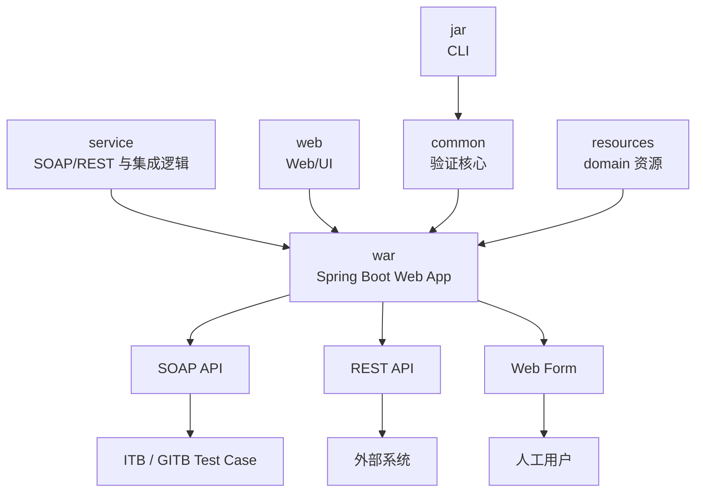
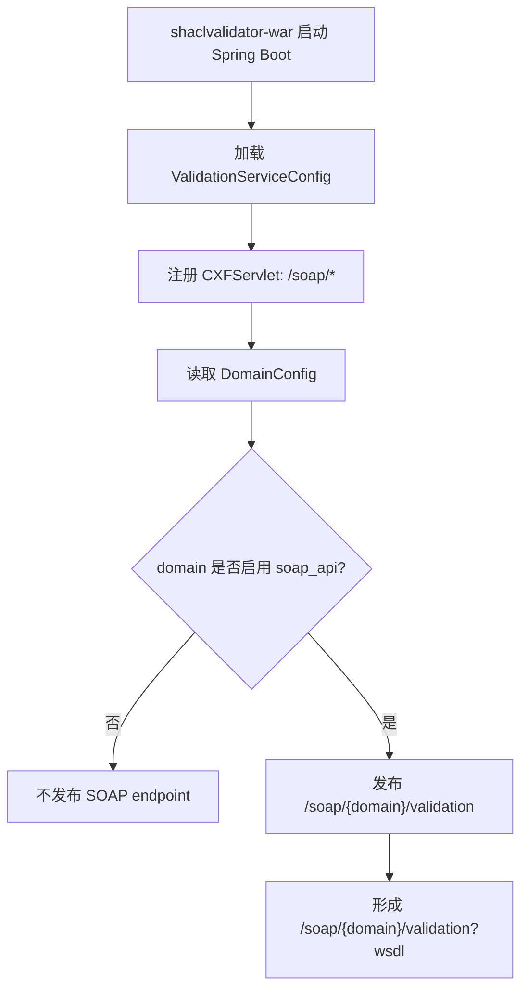
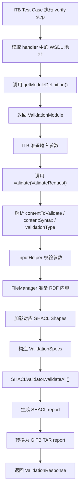
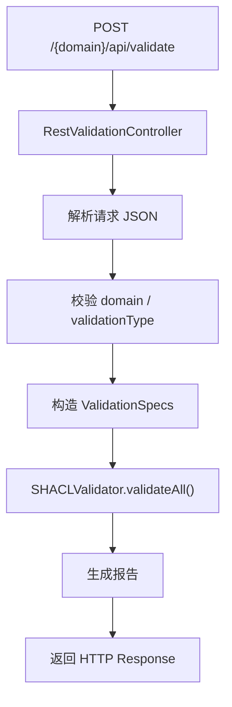
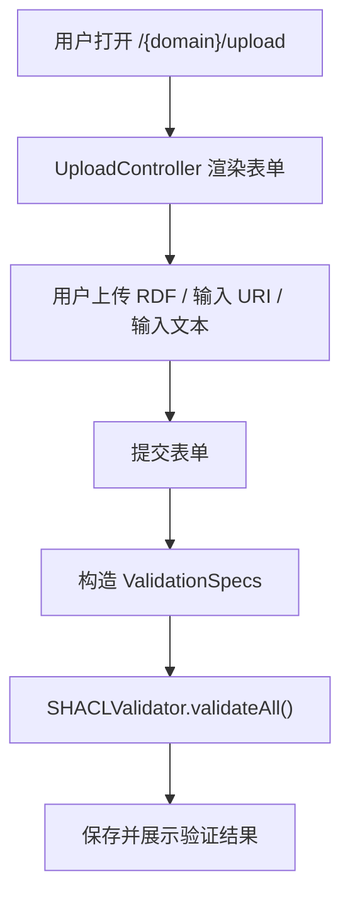
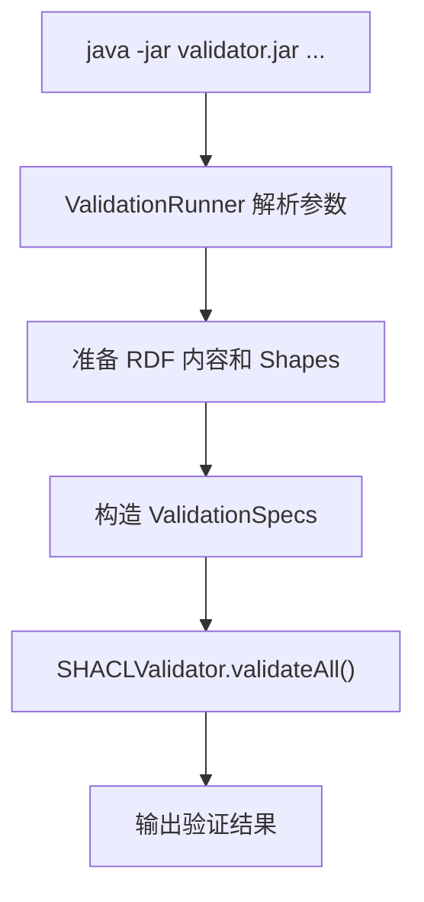
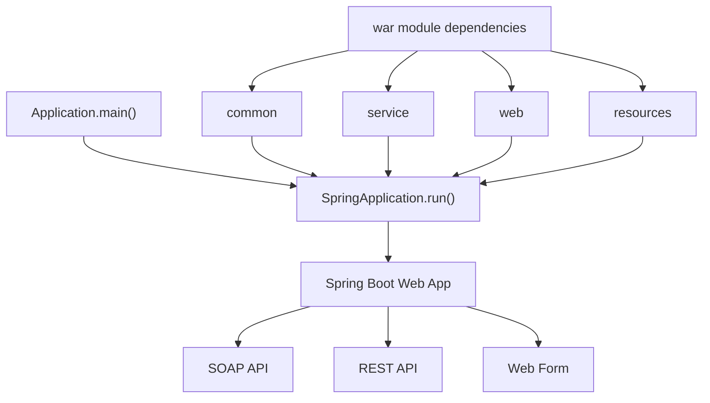
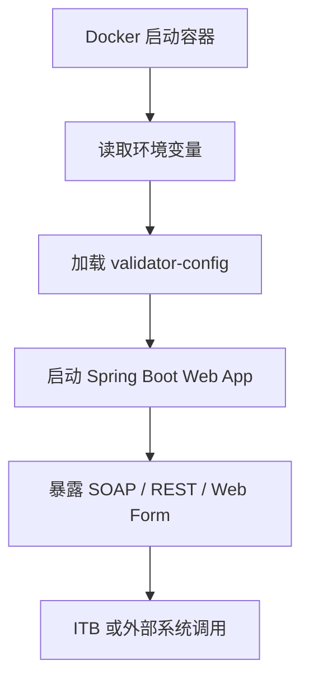
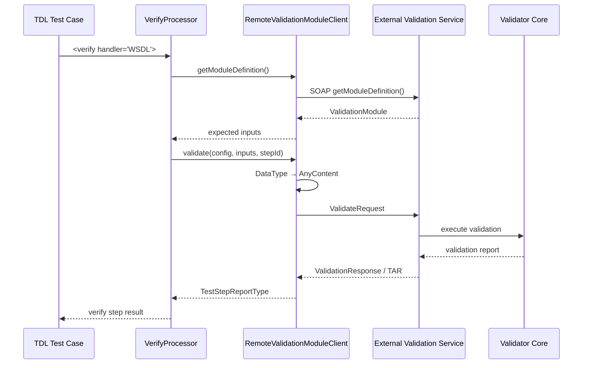

# ITB Validator / Handler 独立部署与 SOAP 集成源码

## 1. 整体框架

本报告研究 ITB 如何通过 Validation Handler 调用 Validator，以及 Validator 独立部署后如何通过 GITB SOAP Validation Service 接入 Test Case。

核心关系是：

```text
                    TDL <verify>
                         ↓
                   VerifyProcessor
                         ↓
                 IValidationHandler
                    /          \
                   /            \
           Built-in Handler   Remote Handler
                 ↓                ↓
            Local call     RemoteValidationModuleClient
                                  ↓
                             SOAP / WSDL
                                  ↓
                         External Validator
```

不同 Validator 的验证对象不同：

| Validator | 验证对象 | 主要规则 |
|---|---|---|
| SHACL Validator | RDF / JSON-LD / Turtle | SHACL Shapes |
| JSON Validator | JSON / YAML | JSON Schema |
| XML Validator | XML | XSD / Schematron |
| CSV Validator | CSV | Table Schema |

它们的具体 Validator Core 不同，但作为外部 Validator 接入 ITB 时，都可以采用 GITB Validation Service 所定义的远程验证接口。

---

## 2. ITB Handler 与 SOAP Client 源码

### 2.1 `IValidationHandler` 与 `VerifyProcessor`

ITB 使用：

```text
gitb-core/src/main/java/com/gitb/validation/IValidationHandler.java
```

统一抽象 Validator。核心方法是：

```java
ValidationModule getModuleDefinition();
TestStepReportType validate(...);
```

其中：

- `getModuleDefinition()`：描述 Validator 需要哪些输入；
- `validate()`：执行验证并返回 Test Step Report。

真正执行 `<verify>` 的入口是：

```text
gitb-engine/src/main/java/com/gitb/engine/processors/VerifyProcessor.java
```

`VerifyProcessor` 根据 `handler` 是否为 URL 选择本地或远程 Validator：

```text
<verify handler="...">
        ↓
VerifyProcessor
        ↓
isURL(handler)?
   /             \
  否              是
  ↓               ↓
ModuleManager   RemoteValidationModuleClient
  ↓               ↓
Built-in        External Validator
```

因此：

```xml
<verify handler="ShaclValidator">
```

走 ITB 本地 Handler；

而：

```xml
<verify handler="http://.../validation?wsdl">
```

走远程 SOAP Validation Service。

确定 Handler 后，`VerifyProcessor` 会调用 `getModuleDefinition()` 获取 expected inputs，解析 `<input>`，检查必填参数，最后执行 `validate()`。

---

### 2.2 `RemoteValidationModuleClient`

远程 Validator 的客户端实现位于：

```text
gitb-remote/src/main/java/com/gitb/remote/validation/
└── RemoteValidationModuleClient.java
```

它：

```text
implements IValidationHandler
```

因此远程 SOAP 服务在 Test Engine 内仍表现为普通 Validation Handler。

远程调用只有两个核心阶段。

#### 获取 Validator 定义

```text
VerifyProcessor
    ↓
RemoteValidationModuleClient.getModuleDefinition()
    ↓
SOAP getModuleDefinition()
    ↓
External Validator
    ↓
ValidationModule
```

这样不同 Validator 可以声明不同输入，而 ITB 不需要为 SHACL、JSON、XML、CSV 分别硬编码参数。

#### 执行验证

ITB 内部输入首先是 `DataType`。发送 SOAP 请求前会转换为 GITB 的 `AnyContent`：

```text
TDL input
   ↓
ITB DataType
   ↓
DataTypeUtils.convertDataTypeToAnyContent()
   ↓
AnyContent
   ↓
ValidateRequest
```

`ValidateRequest` 主要携带：

```text
sessionId
configurations
inputs
```

随后调用：

```text
SOAP validate()
```

返回：

```text
ValidationResponse
    ↓
response.getReport()
    ↓
TestStepReportType / TAR
```

---

### 2.3 返回结果与 callback

验证报告回到 `VerifyProcessor` 后，会作为 `<verify>` Test Step 的 report 继续处理。

GITB 还支持 Validation Service callback。ITB 中：

```text
gitb-testbed-service/src/main/java/com/gitb/tbs/impl/
└── ValidationClientImpl.java
```

可以接收带 `sessionId` 的 `LogRequest`，把外部 Validator 的日志关联到对应 Test Session。

这属于远程集成的辅助能力，主验证链仍然是：

```text
getModuleDefinition()
    ↓
validate()
    ↓
ValidationResponse / TAR
```

---

## 3. External Validator 服务端源码分析

分析对象：`validator/` 目录中和“外部调用 Validator”有关的源码。

关键点：`shaclvalidator-service` 不能简单等同于“SOAP + REST 对外接口模块”。官方 SHACL Validator 是一个 multi-module Maven project，最终由 `shaclvalidator-war` 组装成一个 all-in-one Spring Boot Web application。运行后，同一个应用对外提供 SOAP API、REST API 和 Web Form。

### 3.1 模块结构

```text
validator/
├── shaclvalidator-common/      # 内部核心：配置、输入、文件、SHACL 校验、报告
├── shaclvalidator-resources/   # 默认/预置 domain 资源与配置
├── shaclvalidator-service/     # SOAP/REST 服务与 ITB/GITB 集成逻辑
├── shaclvalidator-web/         # Web/UI 层
├── shaclvalidator-jar/         # CLI 入口
├── shaclvalidator-war/         # 组装为可执行 Spring Boot Web Application
└── etc/docker/                 # Docker 部署相关
```

更准确的理解：



需要注意，模块与运行入口不是一一对应关系：

```text
common / service / web / resources
            ↓
          war
            ↓
可执行 Spring Boot Web App
            ↓
SOAP / REST / Web Form
```

而 CLI 由 `shaclvalidator-jar` 直接调用内部验证核心，不经过 Web Application。

### 3.2 SOAP 集成：ITB 调用重点

相关源码：

```text
shaclvalidator-service/src/main/java/eu/europa/ec/itb/shacl/gitb/
├── ValidationServiceConfig.java
└── ValidationServiceImpl.java
```

#### 3.2.1 `ValidationServiceConfig.java`

这个类定义 SOAP endpoint 的发布逻辑。它本身不是独立服务，而是被 `shaclvalidator-war` 启动的 Spring Boot 应用加载，最后由整个 Web App 对外暴露 SOAP endpoint。



#### 3.2.2 `ValidationServiceImpl.java`

这个类实现 GITB Validation Service，主要有两个方法：

| 方法 | 作用 |
|---|---|
| `getModuleDefinition()` | 告诉 ITB 这个 validator 需要哪些输入 |
| `validate()` | 接收 ITB 的验证请求，执行 SHACL 校验，返回报告 |

SOAP 调用流程：



ITB 中可以这样使用：

```xml
<verify handler="http://shacl-validator:8080/shacl/soap/energy/validation?wsdl">
    <input name="contentToValidate">$metadata</input>
    <input name="contentSyntax">application/ld+json</input>
    <input name="validationType">v1</input>
</verify>
```

这说明 Validator 可以独立部署，ITB 只需要通过 WSDL 调用它，不需要把 Validator 嵌进 ITB 内部。

### 3.3 REST 集成：系统调用入口

相关源码：

```text
shaclvalidator-service/src/main/java/eu/europa/ec/itb/shacl/rest/
└── RestValidationController.java
```

REST 入口：

```text
POST /{domain}/api/validate
```



REST 更适合非 ITB 系统调用，例如后端服务、数据上传平台或自动化脚本。

### 3.4 Web 集成：人工使用入口

相关源码：

```text
shaclvalidator-web/src/main/java/eu/europa/ec/itb/shacl/upload/
└── UploadController.java
```

Web 入口：

```text
GET  /{domain}/upload
POST /{domain}/upload
```



Web Form 主要用于人工测试、规则调试和演示。

### 3.5 CLI 集成：离线调用入口

相关源码：

```text
shaclvalidator-jar/src/main/java/eu/europa/ec/itb/shacl/standalone/
└── ValidationRunner.java
```

CLI 不通过 Web App，而是直接从命令行调用内部验证核心。



常见参数：

```text
-contentToValidate
-validationType
-externalShapes
-reportSyntax
-loadImports
-mergeModelsBeforeValidation
```

### 3.6 WAR 组装：真正运行的 Web 应用

相关源码：

```text
shaclvalidator-war/src/main/java/eu/europa/ec/itb/shacl/
└── Application.java
```

`shaclvalidator-war` 依赖并组装 `common`、`service`、`web`、`resources` 等模块，`Application.main()` 启动最终的 Spring Boot Web Application。SOAP、REST 和 Web Form 都由这个 Web Application 对外提供。



### 3.7 Docker 部署

相关源码：

```text
etc/docker/shacl-validator/Dockerfile
shaclvalidator-war/
```

Docker 负责把 `shaclvalidator-war` 生成的 Web Application JAR 放进容器运行。



关键配置：

| 配置 | 作用 |
|---|---|
| `validator.resourceRoot` | 指向 domain 配置目录 |
| `validator.baseSoapEndpointUrl` | 控制 WSDL 中公布的 SOAP 地址 |
| volume 挂载 | 把外部 `validator-config` 挂进容器 |


---

## 4. 端到端运行机制

前两部分分别说明了 ITB Client 侧和 External Validator 服务端。二者通过 GITB Validation Service 的 SOAP/WSDL 接口连接：



整个机制中，`IValidationHandler` 提供统一抽象，`VerifyProcessor` 负责选择本地或远程 Handler，`RemoteValidationModuleClient` 负责把远程调用转换为 GITB SOAP 请求；独立 Validator 侧则由 `ValidationServiceImpl` 接收请求并进入具体 Validator Core。

因此，SHACL、JSON、XML、CSV 等 Validator 可以保留各自不同的验证逻辑，同时通过统一的 GITB Validation Service 接入 ITB。
