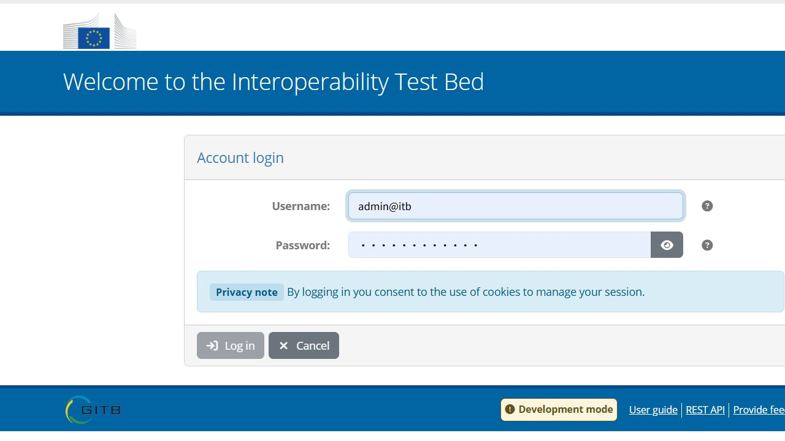
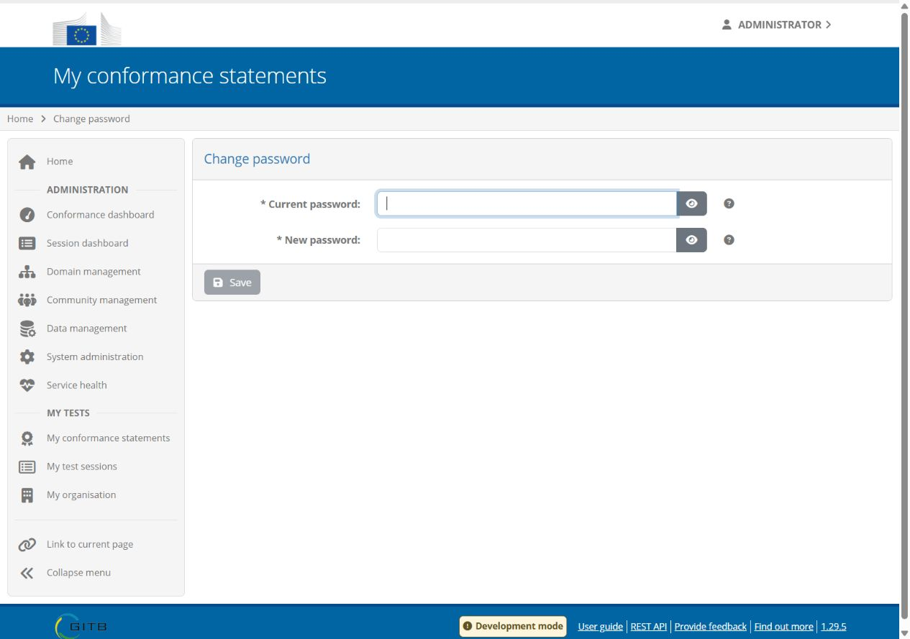
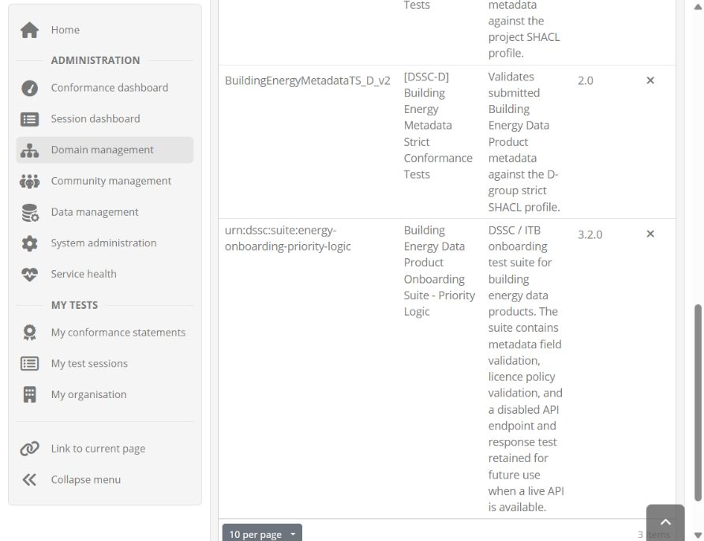
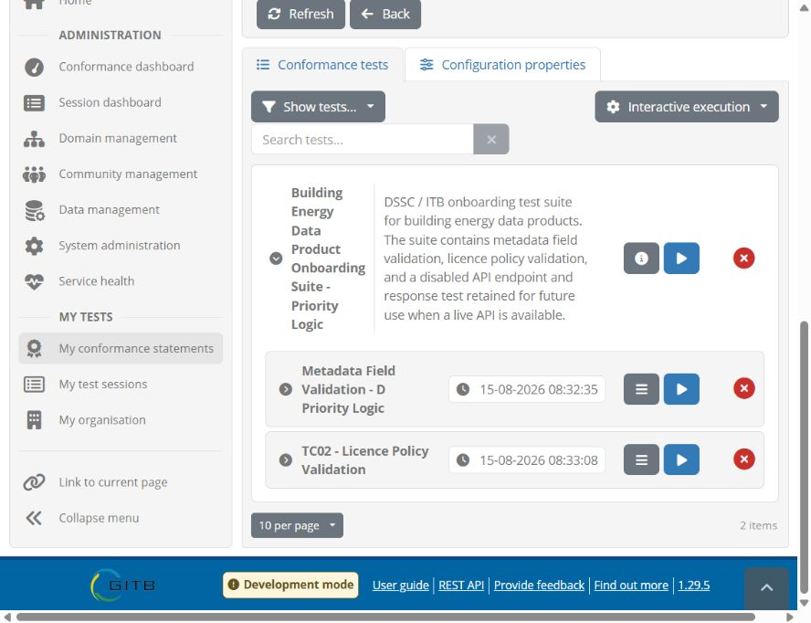
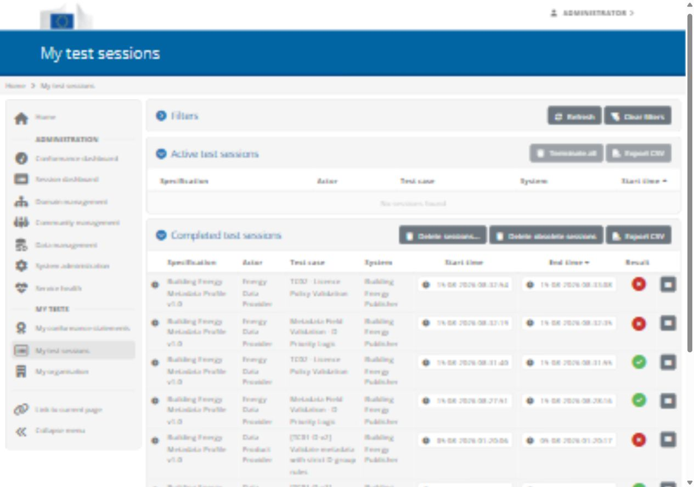
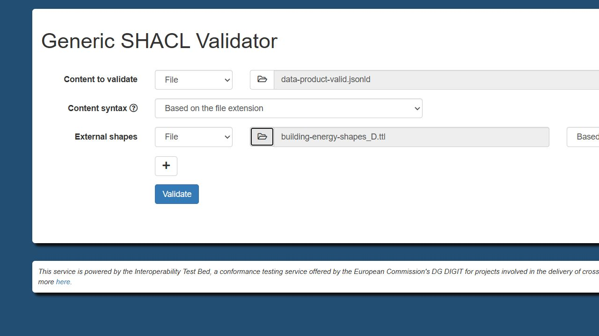
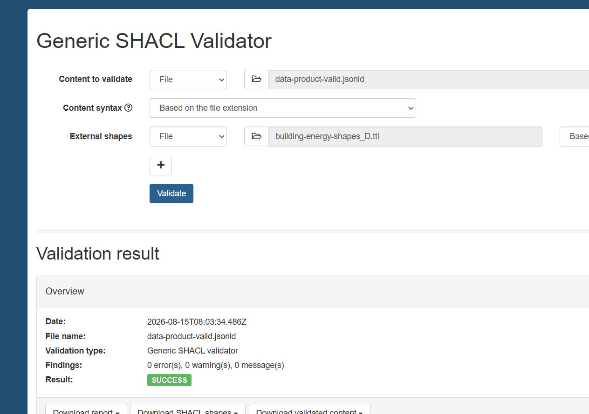
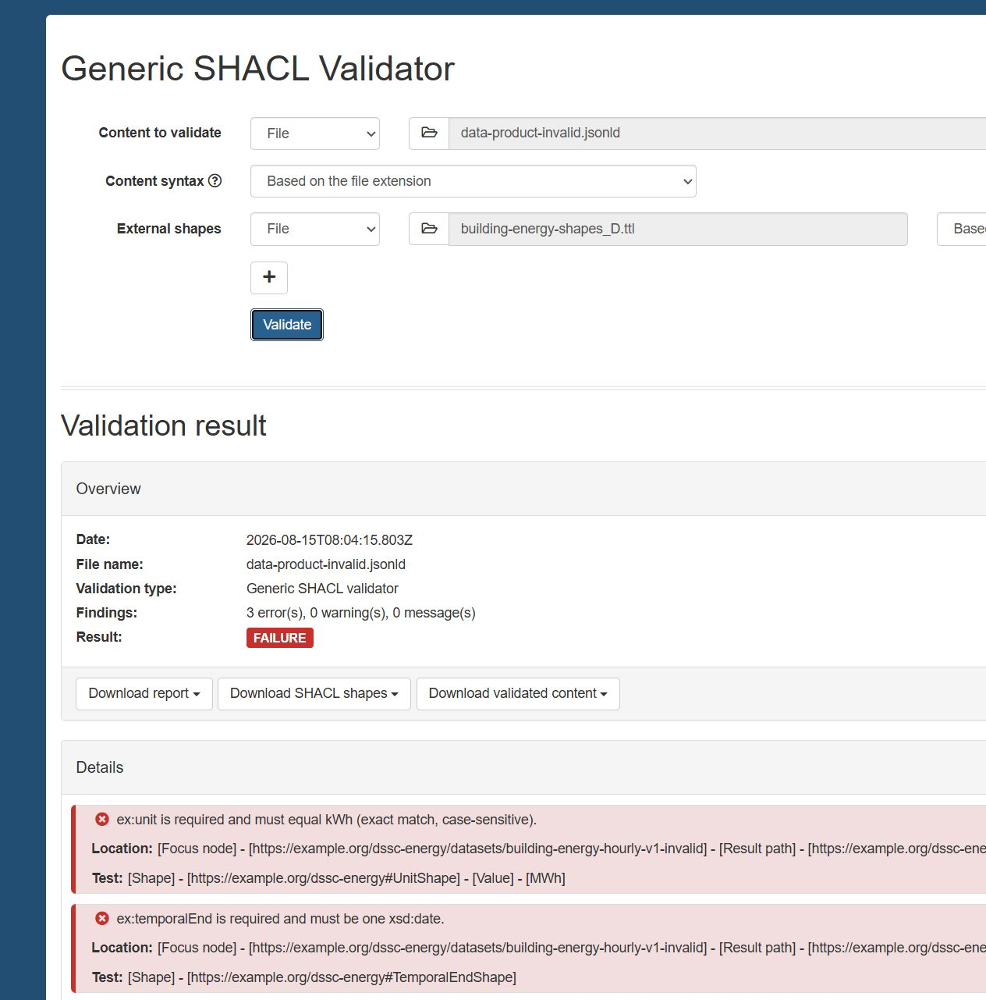

# ITB 使用手册

## 1. 手册用途

本手册面向第一次使用 ITB 的同学，按“看到什么、点击什么、填什么、结果应该是什么”的方式，完整说明如何：

1. 启动本地 ITB 与 SHACL Validator；
2. 登录 ITB；
3. 创建或选择 Domain；
4. 创建 Specification；
5. 上传 D 组 Test Suite 3.2.0；
6. 确认管理员 Organisation，并创建 System 和 Conformance Statement；
7. 分别运行 TC01 和 TC02；
8. 使用原始 valid/invalid JSON-LD 生成四份报告；
9. 查看、下载和命名报告；
10. 处理常见操作错误。

本手册不公开真实密码、API key 或 `.env` 内容。需要密码时，请向本机管理员获取。

本手册的主流程假设读者面对的是第一次启动的全新 ITB：系统中只有初始管理员账号和管理员 Organisation，还没有 Domain、Specification、Test Suite、测试 System 或 Conformance Statement。因此正文从零创建全部测试框架。旧 Test Suite 升级和已有环境迁移不属于首次操作，统一放在文末补充说明。

## 2. 本项目使用的文件

### 2.1 Test Suite

```text
testsuite/dssc-energy-onboarding-testsuite-3.2.0.zip
```

### 2.2 本手册只使用的两个测试输入

```text
Report/交付B组/metadata/data-product-valid.jsonld
Report/交付B组/metadata/data-product-invalid.jsonld
```

### 2.3 预期生成的四份报告

```text
valid_TC01.pdf
valid_TC02.pdf
Invalid_TC01.pdf
Invalid_TC02.pdf
```

## 3. 先理解 ITB 页面中的几个概念

```text
Domain
└── Specification
    ├── Actor
    └── Test Suite
        ├── TC01
        ├── TC02
        └── TC03（当前禁用）

Organisation
└── System
    └── Conformance Statement
        └── 绑定到一个 Specification + Actor
```

| ITB 概念 | 最简单的理解 | 本项目示例 |
|---|---|---|
| Domain | 测试所属的大领域 | `City Energy Data Space` 或 `DSSC Energy` |
| Specification | 要符合的具体规范 | `Building Energy Metadata Profile` |
| Test Suite | 可以执行的测试包 | D 组 Test Suite 3.2.0 |
| Test Case | 一项具体检查 | TC01、TC02 |
| Actor | 受测系统扮演的角色 | `Energy Data Provider` |
| Organisation | 拥有受测系统的组织 | 测试组织 |
| System | 被测试的产品/系统 | `Building Energy Metadata Publisher` |
| Conformance Statement | “这个 System 要按这个 Actor 符合这个 Specification”的声明 | Provider 对 Profile 的声明 |
| Test Session | 一次实际运行记录 | 某个 JSON-LD 运行一次 TC01 |

## 4. 部署或启动本地环境

### 4.1 先区分两种操作

Docker Desktop 和部署手册中的 PowerShell 命令不是两个完全相同的首次部署方法。

| 方式 | 能做什么 | 什么时候使用 |
|---|---|---|
| PowerShell + `docker compose up -d` | 读取项目 Compose 配置，创建网络、数据卷和五个容器，然后启动服务 | 第一次部署必须使用；以后也可使用 |
| Docker Desktop 图形界面 | 查看和启动已经创建好的容器或 Compose 项目 | 第一次命令行部署完成后的日常启动 |

无论使用哪种方式，Windows 上都要先打开 Docker Desktop，因为它负责运行 Docker Engine。单独打开 Docker Desktop 不会自动把项目中的 `docker-compose.yml` 部署成五个新容器。

### 4.2 方法 A：按照部署手册首次部署（第一次必须执行）

#### 第一步：启动 Docker Engine

1. 在 Windows 开始菜单中打开 Docker Desktop。
2. 等待 Docker Desktop 显示 Engine running。
3. Engine 没有启动完成前，不要继续执行命令。

#### 第二步：打开 PowerShell 并进入项目

```powershell
Set-Location "D:\数据空间\DSSC_Toolbox_ITB_with_Validator\testbed"
```

确认当前目录正确：

```powershell
Get-Location
Get-ChildItem
```

列表中应看到 `docker-compose.yml` 和 `.env.example`。

#### 第三步：创建本机 `.env`

第一次部署、还没有 `.env` 时执行：

```powershell
Copy-Item ".env.example" ".env"
```

确认文件存在：

```powershell
Test-Path ".env"
```

结果应为 `True`。`.env` 包含本地数据库和初始账号配置，不要上传到 GitHub，也不要在录屏中打开它。

#### 第四步：检查 Compose 配置

```powershell
docker compose config --quiet
```

命令没有输出并返回提示符，通常表示配置语法通过。如果显示错误，应先检查 `.env` 和 `docker-compose.yml`，不要继续启动。

#### 第五步：首次创建并启动五个服务

```powershell
docker compose up -d
```

第一次运行可能需要下载镜像，因此会比以后启动更慢。等待命令完成后检查：

```powershell
docker compose ps
```

正常情况下应看到：

- `itb-mysql`；
- `itb-redis`；
- `itb-srv`；
- `itb-ui`；
- `shacl-validator`。

`itb-mysql` 最终应显示 healthy。第一次初始化可能需要等待一两分钟。到这里，Compose 网络、数据卷和容器才算真正创建完成。

### 4.3 方法 B：以后使用 Docker Desktop 图形界面启动

只有方法 A 至少成功执行过一次、Docker Desktop 中已经能看到上述容器时，才能使用本方法。

1. 打开 Docker Desktop。
2. 等待 Docker Engine 运行。
3. 点击左侧 `Containers`。
4. 查找本项目的 Compose 分组；它通常显示为 `testbed`，也可能根据第一次部署时的项目名显示为其他名称。
5. 展开分组，确认其中包含：

   - `itb-mysql`；
   - `itb-redis`；
   - `itb-srv`；
   - `itb-ui`；
   - `shacl-validator`。

6. 点击整个 Compose 分组右侧的 Start/播放按钮，让 Docker Desktop 启动整组服务。
7. 不建议第一次使用者逐个随机启动容器；启动整组可以减少漏掉数据库、Redis 或 Validator 的情况。
8. 等待五个容器均显示 Running，并等待 `itb-mysql` 显示 healthy。
9. 如果 Docker Desktop 中找不到该项目、缺少容器或只看到镜像，说明首次 Compose 部署尚未完成，应返回方法 A。

方法 B 不会重新导入 Test Suite，也不会清空 ITB 数据。它只是启动方法 A 已经创建的容器。

### 4.4 两种方法如何选择

| 当前情况 | 应选择的方法 |
|---|---|
| 第一次拿到仓库，Docker Desktop 中没有 ITB 容器 | 方法 A |
| 更改了 `.env` 或 `docker-compose.yml` | 方法 A |
| 某个容器缺失，需要重新创建 | 方法 A |
| 昨天已经部署成功，今天只想重新打开 ITB | 方法 B，也可以再次使用方法 A |
| 不确定当前环境是否完整 | 方法 A，并执行 `docker compose ps` |

再次执行 `docker compose up -d` 通常会复用现有数据卷，不会删除 Domain 和报告。不要添加 `-v`，也不要为了普通启动先执行 `docker compose down -v`。

### 4.5 两种方法完成后都要检查网址

在自己的浏览器中打开：

- ITB：<http://localhost:9000>
- 通用 Validator：<http://localhost:8081/shacl/any/upload>
- 固定 Energy Validator：<http://localhost:8081/shacl/energy/upload>
- SOAP WSDL：<http://localhost:8081/shacl/soap/energy/validation?wsdl>

如果 ITB 页面可以打开，说明 UI 已启动；如果 WSDL 可以打开，说明 Validator SOAP 入口可访问。

网页能打开只是基础检查。正式运行 TC01 前，还要确保五个容器都在运行，并且 ITB 能通过 Docker 内网访问 Validator。

## 5. 登录 ITB

### 5.1 第一次部署：找到初始临时密码

这一小节只适用于刚刚创建数据库、还没有人登录过的新环境。如果 ITB 已经有人修改过密码，请直接向管理员获取当前密码。

1. 确认 `itb-ui` 已经启动：

   ```powershell
   Set-Location "D:\数据空间\DSSC_Toolbox_ITB_with_Validator\testbed"
   docker compose ps
   ```

2. 查看 UI 容器启动日志：

   ```powershell
   docker logs itb-ui
   ```

3. 在日志中查找 `admin@itb`、`password` 或初始管理员信息。
4. 如果日志较长，可以只筛选相关行：

   ```powershell
   docker logs itb-ui 2>&1 | Select-String -Pattern "admin@itb|password"
   ```

5. 将日志中显示的首次临时密码复制到密码管理器或只供本人使用的安全位置。
6. 不要对包含密码的终端窗口截图，不要把密码粘贴到聊天、报告或 GitHub。

`testbed/.env` 中的 `DB_DEFAULT_PASSWORD` 用于初始化本地 ITB。它属于敏感配置，不应写入使用手册。ITB 数据库初始化完成或用户已经修改密码后，修改 `.env` 再重启容器通常不会把现有账号密码重置为新值。

### 5.2 使用初始密码登录

1. 打开 <http://localhost:9000>。
2. 点击页面中的 `Click to log in`。
3. 用户名填写 `admin@itb`。
4. 密码填写上一小节从 `itb-ui` 日志中找到的初始临时密码。
5. 点击登录按钮。
6. 如果页面提示密码错误，先确认没有复制多余空格，并确认当前环境是否已经有人完成首次登录和改密。



### 5.3 首次登录后修改密码

ITB 可能在首次登录时直接要求修改密码。如果没有自动弹出，也可以手动修改：

1. 登录后点击页面右上角的 `Administrator`。
2. 在展开的账号菜单中点击 `Change password`。
3. 在 `Current password` 中填写刚才登录使用的当前密码。
4. 在 `New password` 中填写新的强密码。
5. 如果不确定密码要求，点击输入框旁边的 `?` 查看当前 ITB 实例的规则。
6. 点击密码框右侧的眼睛按钮可以临时检查输入，但屏幕共享或录屏时不要显示密码。
7. 点击 `Save`。
8. 保存成功后，点击右上角账号菜单中的 `Logout`。
9. 使用 `admin@itb` 和新密码重新登录一次，确认新密码已经生效。
10. 将新密码保存在密码管理器中，不要写回 `.env`，也不要写进本项目文档。



### 5.4 忘记已经修改过的密码

- `docker logs itb-ui` 中显示的是首次初始化信息，不能找回后来设置的新密码；
- 修改 `.env` 中的 `DB_DEFAULT_PASSWORD` 并重启容器，不等于重置现有数据库用户密码；
- 如果还有其他管理员账号，应由管理员通过 ITB 用户管理功能处理；
- 如果唯一管理员无法登录，应按 ITB 官方账号恢复流程和本地备份处理，不要为了重置密码执行 `docker compose down -v`；
- `down -v` 会删除数据卷，可能同时丢失 Domain、Specification、Test Suite 和历史报告。

登录成功后，左侧通常可以看到：

- `Domain management`；
- `Community management`；
- `System administration`；
- `My conformance statements`；
- `My test sessions`；
- `My organisation`。

## 6. 第一次配置的完整路线

全新 ITB 中没有现成测试框架。第一次配置必须按以下顺序进行：

```text
创建 Domain
→ 创建 Specification
→ 上传 Test Suite 3.2.0
→ 检查自动导入的 Actors
→ 在管理员 Organisation 下创建测试 System
→ 创建 Conformance Statement
→ 运行 TC01 和 TC02
→ 查看 Test Sessions 并下载报告
```

不要跳过中间步骤。例如，没有 Specification 就没有地方上传 Test Suite；没有 System 和 Conformance Statement，就不能以普通测试者身份运行 Test Case。

本手册使用以下首次配置名称：

| 对象 | 建议名称 |
|---|---|
| Domain | `City Energy Data Space` |
| Specification | `Building Energy Metadata Profile v1.0` |
| Test Suite | `Building Energy Data Product Onboarding Suite - Priority Logic` 3.2.0 |
| System | `Building Energy Metadata Publisher` |
| SUT Actor | `Energy Data Provider` |

这些名称是页面显示名称。Test Suite 版本 `3.2.0` 不等于 Specification 版本 `v3.2.0`。

## 7. 创建第一个 Domain

1. 登录后点击左侧 `Domain management`。
2. 第一次使用时，Domain 列表通常为空。
3. 点击创建 Domain 的按钮。
4. Short name 填写 `City Energy Data Space`。
5. Full name 填写 `City Energy Data Space`。
6. Description 填写 `Data space domain for building energy data product onboarding tests.`。
7. 保持 `Hidden` 未勾选。
8. 点击保存。
9. 等待页面返回 Domain 列表。
10. 点击刚创建的 `City Energy Data Space` 进入详情。

Domain 是最外层业务分类。此时只创建了领域，还没有规范和测试。

## 8. 创建 Specification

1. 进入目标 Domain 的详情页。
2. 找到 `Specifications` 区域或标签。
3. 点击创建 Specification 的按钮。
4. 填写 Short name。
5. 填写 Full name。
6. 填写 Description。
7. `Report metadata` 可以暂时留空。
8. `Hidden` 不要勾选，否则普通测试用户可能看不到。
9. 点击 `Save changes`。
10. 保存成功后点击新 Specification 的名称进入详情。

如果保存按钮不可点击，检查所有带 `*` 的必填字段是否都已填写。

## 9. 上传 Test Suite 3.2.0

### 9.1 进入上传位置

1. 确认当前页面是刚创建的 Specification。
2. 向下滚动或点击 `Test suites` 标签。
3. 点击 `Upload test suite`。

### 9.2 选择 ZIP

在文件选择窗口中找到：

```text
D:\数据空间\DSSC_Toolbox_ITB_with_Validator\testsuite\dssc-energy-onboarding-testsuite-3.2.0.zip
```

1. 选中 ZIP；
2. 点击打开；
3. 回到 ITB 上传窗口；
4. 点击继续、确认或上传按钮；
5. 等待 ITB 完成 TDL 检查和导入。

不要解压后逐个上传 XML。ITB 需要上传完整 ZIP。

### 9.3 检查上传结果

上传成功后，列表中应看到：

| 项目 | 预期值 |
|---|---|
| ID | `urn:dssc:suite:energy-onboarding-priority-logic` |
| Name | `Building Energy Data Product Onboarding Suite - Priority Logic` |
| Version | `3.2.0` |



第一次上传成功后，列表中应该只有这一项 Test Suite 3.2.0。如果列表为空，说明上传没有完成；应先查看上传提示和 ITB 日志，再继续后面的步骤。

### 9.4 ZIP 结构要求

ZIP 根目录必须直接包含 `testSuite.xml`：

```text
testSuite.xml
testCases/
  TC01_METADATA_FIELD_VALIDATION.xml
  TC02_LICENSE_POLICY_VALIDATION.xml
  TC03_API_RESPONSE_VALIDATION.xml
Resources/
  building-energy-shapes_D.ttl
  api-response.schema.json
  license-whitelist.json
```

ZIP 外层不能再多包一层 `testsuite/` 文件夹。

## 10. 检查 Actor

1. 在 Specification 页面点击 `Actors` 标签。
2. 检查是否出现以下 Actor：

   - `Energy Data Provider`；
   - `City Energy Data Space Authority`；
   - `ITB / Validation Engine`；
   - `Data Space Gateway`。

3. `Energy Data Provider` 是默认 SUT Actor。
4. 其他 Actor 是测试环境模拟的参与方。

Test Suite 已定义这些 Actor，上传成功后 ITB 通常会导入或关联它们。若看不到 Actor，应先检查 Test Suite 上传结果，不要直接运行测试。

## 11. 在管理员 Organisation 下创建第一个 System

首次部署会有一个管理员 Organisation，例如 `Admin organisation`。这里不需要再创建第二个 Organisation，只需要在它下面创建被测 System。

1. 点击左侧 `My organisation`。
2. 页面顶部确认当前 Organisation 是管理员 Organisation。
3. 找到 Systems 区域。
4. 第一次使用时，测试 System 列表通常为空。
5. 点击创建 System。
6. Short name 填写 `Building Energy Metadata Publisher`。
7. Full name 填写 `Building Energy Metadata Publisher`。
8. Description 填写 `System under test that submits building energy metadata.`。
9. 保持隐藏选项未勾选。
10. 点击保存。
11. 保存后确认 System 出现在列表中。

System 表示被测试的产品或服务，不是 Test Suite，也不是用户账号。到这一步仍然不能运行测试，因为 System 还没有与 Specification 和 Actor 建立 Conformance Statement。

## 12. 创建 Conformance Statement

Conformance Statement 把 System、Specification 和 Actor 连接起来。没有它，就不能从普通测试页面运行 TC01/TC02。

1. 点击左侧 `My conformance statements`。
2. 点击 `Create statements`。
3. 选择 System：`Building Energy Metadata Publisher`。
4. 选择 Domain：刚才使用的 Domain。
5. 选择 Specification：刚创建并上传 3.2.0 的 Specification。
6. 选择 Actor：`Energy Data Provider`。
7. 点击确认创建。
8. 回到 Conformance Statement 列表。
9. 展开 Domain。
10. 展开 Specification。
11. 点击 `Energy Data Provider` 进入详情。

## 13. 检查 TC01 和 TC02

进入 Conformance Statement 后，在 `Conformance tests` 标签中应看到：

- `Metadata Field Validation - D Priority Logic`；
- `TC02 - Licence Policy Validation`。



TC03 在 XML 中设置为禁用，当前不参与测试，也不应被写成已经完成的验证能力。

每一行右侧的蓝色播放按钮用于启动该 Test Case。不要点击红色删除按钮。

## 14. 运行 valid + TC01

1. 找到 `Metadata Field Validation - D Priority Logic`。
2. 点击该行右侧蓝色播放按钮。
3. 等待测试会话页面打开。
4. 点击 `Start`。
5. 页面提示上传 JSON-LD 时，点击选择文件。
6. 选择：

   ```text
   Report/交付B组/metadata/data-product-valid.jsonld
   ```

7. 确认文件名正确。
8. 点击 `Submit`。
9. 等待 Validator 执行。
10. 不要在运行过程中刷新或关闭页面。
11. 结束后查看顶部结果。

预期：

```text
SUCCESS
```

SHACL 验证步骤应成功，并且没有 error。

## 15. 运行 valid + TC02

1. 返回 Conformance Statement 的测试列表。
2. 找到 `TC02 - Licence Policy Validation`。
3. 点击该行右侧蓝色播放按钮。
4. 点击 `Start`。
5. 上传同一个：

   ```text
   Report/交付B组/metadata/data-product-valid.jsonld
   ```

6. 点击 `Submit`。
7. 等待测试结束。

预期：

```text
SUCCESS
```

报告中应看到：

- actual = 1；
- expected = 1；
- 许可证存在于 Authority 白名单。

## 16. 运行 invalid + TC01

1. 返回测试列表。
2. 启动 `Metadata Field Validation - D Priority Logic`。
3. 点击 `Start`。
4. 上传：

   ```text
   Report/交付B组/metadata/data-product-invalid.jsonld
   ```

5. 点击 `Submit`。
6. 等待测试结束。

预期：

```text
FAILURE
3 errors
```

三个错误应为：

1. `unit` 为 `MWh`，但要求 `kWh`；
2. 缺少 `temporalEnd`；
3. 缺少 `providerName`。

这是正确的反向测试结果，不是系统故障。

## 17. 运行 invalid + TC02

1. 返回测试列表。
2. 启动 `TC02 - Licence Policy Validation`。
3. 点击 `Start`。
4. 上传同一个 invalid JSON-LD。
5. 点击 `Submit`。
6. 等待测试结束。

预期：

```text
FAILURE
```

许可证数量应为：

```text
actual   = 0
expected = 1
```

因为许可证数量检查已经失败，所以不会继续进行白名单匹配。

## 18. 四次测试检查表

| 次数 | 输入 | Test Case | 正确结果 |
|---:|---|---|---|
| 1 | valid | TC01 | SUCCESS |
| 2 | valid | TC02 | SUCCESS |
| 3 | invalid | TC01 | FAILURE，3 errors |
| 4 | invalid | TC02 | FAILURE，缺少许可证 |

invalid 出现 FAILURE 才说明 Validator 正确识别了错误。不要为了让页面全绿而修改预期结果。

## 19. 查看 Test Session

1. 点击左侧 `My test sessions`。
2. 打开 `Completed test sessions`。
3. 按时间找到刚才四次运行。
4. 确认有两条 SUCCESS、两条 FAILURE。
5. 点击一条记录进入详情。
6. 展开每个步骤查看 Findings。



如果列表中测试很多，可以按 Test Case、System、结果或时间筛选。

## 20. 下载和命名 PDF 报告

对每一次会话分别操作：

1. 打开 Test Session 详情；
2. 检查输入文件和 Test Case 是否匹配；
3. 点击 `Download report`；
4. 选择 PDF 格式；
5. 下载完成后立即重命名，避免混淆。

建议命名：

| 输入 | Test Case | 文件名 |
|---|---|---|
| valid | TC01 | `valid_TC01.pdf` |
| valid | TC02 | `valid_TC02.pdf` |
| invalid | TC01 | `Invalid_TC01.pdf` |
| invalid | TC02 | `Invalid_TC02.pdf` |

保存到：

```text
Report/交付B组/validation-reports/
```

下载后逐份打开，检查：

- 第一页结果；
- Test name；
- Session ID；
- Findings 数量；
- 页码是否连续；
- 是否存在文字裁切、空白页或下载损坏。

## 21. 直接使用 Validator 上传 TTL（辅助演示）

这一步不经过 ITB，适合展示“JSON-LD 数据 + TTL 规则 = SHACL 结果”。

1. 打开 <http://localhost:8081/shacl/any/upload>。
2. 在 `Content to validate` 中选择 `File`。
3. 上传 valid 或 invalid JSON-LD。
4. Content syntax 保留按扩展名识别，或选择 JSON-LD。
5. 在 `External shapes` 中选择 `File`。
6. 上传：

   ```text
   Report/交付B组/shacl-rules/building-energy-shapes_D.ttl
   ```

7. Shapes syntax 保留自动识别，或选择 Turtle。
8. 点击 `Validate`。



valid 预期：



invalid 预期：



注意：JSON-LD 是被检查的数据，TTL 是检查规则，不能上传反。

## 22. 结果解释

| 状态 | 应如何解释 |
|---|---|
| SUCCESS | 本次输入满足该 Test Case 的全部启用规则 |
| FAILURE | 输入可以测试，但违反至少一项规则 |
| INAPPLICABLE | 输入包含当前 Profile 范围外内容；当前实现通常显示为 FAILURE，并在消息中标识 |
| UNTESTABLE | 文件无法解析、Validator 不可用、网络或 Handler 故障，无法得出合规结论 |

只有 TC01 和 TC02 都成功，才能判定当前 D 组元数据准入通过。

## 23. 常见问题

### 23.1 ITB 页面打不开

执行：

```powershell
Set-Location "D:\数据空间\DSSC_Toolbox_ITB_with_Validator\testbed"
docker compose ps
docker logs itb-ui --tail 100
docker logs itb-srv --tail 100
```

确认 Docker Desktop 已运行，端口 9000 没有冲突。

### 23.2 Validator 页面打不开

```powershell
docker compose ps
docker logs shacl-validator --tail 100
```

确认访问的是宿主机端口 8081。

### 23.3 ITB 调不到 Validator

Test Case Handler 必须使用 Docker 内部地址：

```text
http://shacl-validator:8080/shacl/soap/energy/validation?wsdl
```

不能在 ITB 容器内部写 `localhost:8081`。

### 23.4 Test Suite 上传失败

检查：

- 上传的是 ZIP，不是文件夹；
- ZIP 根目录直接包含 `testSuite.xml`；
- XML 是 UTF-8；
- Test Case ID 与引用一致；
- 使用的是 3.2.0 ZIP。

### 23.5 上传后看不到测试

检查：

1. Test Suite 是否出现在正确 Specification；
2. Actor 是否已经导入；
3. System 是否创建；
4. Conformance Statement 是否绑定正确 Specification 和 `Energy Data Provider`；
5. Conformance Statement 是否已经创建成功。

### 23.6 valid 意外失败

检查：

- 是否误上传 invalid 文件；
- 文件名是否正确；
- TC01 是否加载 `validationType=v1`；
- Validator 是否加载当前 TTL；
- TC02 白名单资源是否存在；
- Validator 和 ITB 日志是否出现解析或连接错误。

### 23.7 invalid 显示 FAILURE

这是预期结果，不需要修复 ITB。应展开 Findings，确认失败原因和原始输入一致。

### 23.8 容器名称冲突

先检查：

```powershell
docker ps -a
```

不要直接删除不认识的容器。如果是保留的 ITB 环境与单独 Validator 网络不同，可由管理员确认后连接网络：

```powershell
docker network connect itb_default shacl-validator
docker start shacl-validator
```

## 24. 停止和恢复

停止但保留数据库和测试历史：

```powershell
Set-Location "D:\数据空间\DSSC_Toolbox_ITB_with_Validator\testbed"
docker compose stop
```

再次启动：

```powershell
docker compose start
docker compose ps
```

不要随意执行：

```powershell
docker compose down -v
```

`-v` 会删除数据卷，可能丢失账号、Domain、Specification、Test Suite 和测试历史。

## 25. Demo 推荐讲解顺序

1. 展示 `docker compose ps` 中的五个服务；
2. 登录 ITB；
3. 解释 Domain、Specification、Test Suite、Actor；
4. 展示 Test Suite 3.2.0；
5. 展示 TC01 和 TC02；
6. 使用 valid 运行两个 Test Case；
7. 使用 invalid 运行两个 Test Case；
8. 打开 My test sessions，展示两条成功和两条失败；
9. 下载一份成功报告和一份失败报告；
10. 说明 FAILURE 是反向测试的正确结果；
11. 最后展示通用 Validator 的 JSON-LD + TTL 手工验证。

## 26. 操作完成检查表

- [ ] Docker Desktop 已运行；
- [ ] 五个容器均已启动；
- [ ] ITB 和 Validator 地址均可访问；
- [ ] 已登录 ITB；
- [ ] 进入正确 Domain；
- [ ] 已从零创建 Specification；
- [ ] Test Suite 3.2.0 上传成功；
- [ ] `Energy Data Provider` Actor 存在；
- [ ] System 已创建；
- [ ] Conformance Statement 绑定正确；
- [ ] valid + TC01 为 SUCCESS；
- [ ] valid + TC02 为 SUCCESS；
- [ ] invalid + TC01 为 FAILURE，3 errors；
- [ ] invalid + TC02 为 FAILURE，许可证数量 0/1；
- [ ] 四份 PDF 已下载并正确命名；
- [ ] 报告已逐份打开检查；
- [ ] 截图和文档没有泄露密码、API key 或 `.env` 内容。

## 27. 相关文档

- 本地部署：`ITB本地部署指南.md`
- Test Suite 设计：`D_itb_test_suite_design.md`
- 四报告错误分析：`D_validation_error_analysis.md`
- 图文端到端指南：`Report/demo/ITB_END_TO_END_GUIDE.md`
- 演示视频：`Report/demo/ITB_Validator_Demo.mp4`

## 28. 补充：以后已有旧 Test Suite 时如何升级

本节不是第一次使用时的必做步骤。只有后续已经存在旧 Specification 或旧 Test Suite，准备升级测试实现时才使用。

上传新 Test Suite 不会自动删除旧 Test Suite。已有环境有两种处理方式：

### 28.1 保留旧环境，创建新的 Specification

适合 Demo、对比测试或需要保留历史配置的情况：

1. 保留原 Domain；
2. 创建新的 Specification；
3. 只向新 Specification 上传新 Test Suite；
4. 创建指向新 Specification 的 Conformance Statement；
5. 旧 Specification、旧会话和旧报告继续保留。

### 28.2 在原 Specification 中升级 Test Suite

适合底层 Profile 没有变化、只有测试实现升级的正式环境：

1. 先备份旧报告和配置；
2. 将新 Test Suite 上传到原 Specification；
3. 使用正向和反向输入完成回归测试；
4. 确认新套件稳定后，再解除关联或删除旧 Test Suite；
5. 检查现有 Conformance Statement 是否只显示预期 Test Case。

不要仅因为 Test Suite 版本从 2.0 升级到 3.2.0，就自动把 Specification 名称改成 v3.2.0。Specification 版本和 Test Suite 版本需要分别管理。
