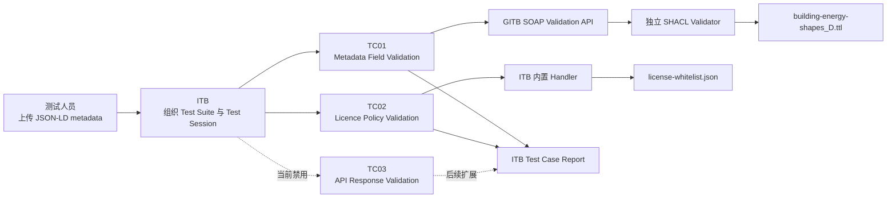

# DSSC Toolbox D 组：ITB + SHACL Validator

本仓库是 DSSC Toolbox 研究项目 D 组的交付仓库，研究方向是 **conformance testing（符合性测试）与 validation（验证）**。

项目使用 Building Energy Consumption Data Product 作为统一场景：数据提供方提交建筑能耗数据产品的 JSON-LD metadata，SHACL Validator 按 D 组规则检查数据，Interoperability Test Bed（ITB）负责编排 Test Case、保存 Test Session，并生成可复查的测试报告。

## 1. 当前完成情况

| 内容 | 状态 | 说明 |
|---|---|---|
| ITB 测试级本地部署 | 已完成 | Docker Compose 同时启动 ITB、MySQL、Redis 和独立 SHACL Validator |
| 自定义 SHACL 规则 | 已完成 | 检查必填字段、数据类型、枚举值、时间、HTTPS endpoint、license 和额外字段 |
| TC01 Metadata Field Validation | 已完成并运行 | ITB 通过 SOAP API 调用独立 SHACL Validator |
| TC02 Licence Policy Validation | 已完成并运行 | 使用 ITB Handler 提取 license 并与白名单比对 |
| TC03 API Response Validation | 已设计，当前禁用 | 等待稳定的真实 API endpoint 后再启用 |
| Valid / Invalid 演示 | 已完成 | 已保存四份 ITB PDF 报告和完整演示截图 |
| Test Suite | 已完成 | 当前正式版本为 `3.2.0` |
| 源码与部署分析 | 已完成 | 包含 ITB Test Engine、Validator、SOAP 接入和报告生成链分析 |

当前最低验收路径已经打通：合法 metadata 可以通过，错误 metadata 会失败，ITB 报告能够显示具体的 focus node、result path 和错误信息。

## 2. 系统关系



三者的区别：

- **SHACL** 是 RDF/JSON-LD 数据的规则语言；
- **SHACL Validator** 是执行规则并返回验证结果的工具；
- **ITB** 是组织 Test Suite、Test Case、被测系统和测试报告的平台。

## 3. 快速启动

### 3.1 环境要求

- Windows 11 或其他支持 Docker 的系统；
- Docker Desktop；
- Docker Compose 2.0 或以上版本。

### 3.2 首次启动

在仓库根目录打开 PowerShell：

```powershell
Copy-Item .\testbed\.env.example .\testbed\.env
Set-Location .\testbed
docker compose up -d
docker compose ps
```

`.env` 只用于本机运行，已被 Git 忽略。实际使用时应修改其中的默认密码，不要把真实密码提交到仓库。

主要地址：

| 服务 | 地址 |
|---|---|
| ITB 页面 | `http://localhost:9000` |
| ITB 后端 | `http://localhost:8080/itbsrv` |
| Building Energy Validator | `http://localhost:8081/shacl/energy/upload` |
| 通用 SHACL Validator | `http://localhost:8081/shacl/any/upload` |
| Energy Validator SOAP WSDL | `http://localhost:8081/shacl/soap/energy/validation?wsdl` |

首次登录 ITB 时，可以通过以下命令查找一次性密码：

```powershell
docker logs itb-ui
```

完整部署、登录、Test Suite 导入和故障处理参见 [ITB本地部署指南](Report/ITB本地部署指南.md) 与 [ITB使用手册](Report/ITB使用手册.md)。

### 3.3 最短演示流程

1. 启动 `testbed/docker-compose.yml` 中的服务；
2. 在 ITB 中导入 `testsuite/dssc-energy-onboarding-testsuite-3.2.0.zip`；
3. 创建 Provider System 和 Conformance Statement；
4. 用 `data-product-valid.jsonld` 分别运行 TC01 和 TC02，预期均为 `SUCCESS`；
5. 用 `data-product-invalid.jsonld` 分别运行 TC01 和 TC02，预期均为 `FAILURE`；
6. 在 Invalid TC01 报告中解释 `unit`、`temporalEnd` 和 `providerName` 三项错误；
7. 展示 Test Session、PDF 报告和 Test Suite 设计。

## 4. 核心测试结果

| 输入 | Test Case | 预期结果 | 主要含义 |
|---|---|---|---|
| `data-product-valid.jsonld` | TC01 | SUCCESS | metadata 字段符合 D 组 SHACL profile |
| `data-product-valid.jsonld` | TC02 | SUCCESS | 声明了唯一且被允许的 license |
| `data-product-invalid.jsonld` | TC01 | FAILURE | unit 错误，并缺少 temporalEnd 和 providerName |
| `data-product-invalid.jsonld` | TC02 | FAILURE | 没有声明满足政策要求的 license |

四份正式结果位于 `Report/valid_TC01.pdf`、`Report/valid_TC02.pdf`、`Report/Invalid_TC01.pdf` 和 `Report/Invalid_TC02.pdf`。

## 5. 项目文件说明

下面逐项说明 D 组编写、配置或生成的项目文件。`validator/` 是官方 SHACL Validator 上游源码，文件数量较多，因此在 5.9 节按模块说明；其内部 Java、资源和测试文件均属于对应模块。

### 5.1 仓库根目录

| 文件 | 内容 |
|---|---|
| `.gitattributes` | 规定 `.ttl` 文件使用 LF 换行，避免跨系统运行时产生格式差异 |
| `.gitignore` | 忽略 `.env`、构建产物、日志、系统文件和编辑器配置 |
| `README.md` | 项目首页，即当前文件 |

### 5.2 `Report/`：研究和交付文档

| 文件 | 内容 |
|---|---|
| `Report/分工.md` | D 组 ITB、TTL、Validator、Test Suite 和 Demo 模块的成员分工 |
| `Report/D_itb_overview.md` | Data Space、ITB、Test Suite、Test Case、GITB TDL、Validator 和输入输出总览 |
| `Report/D_itb_test_suite_design.md` | TC01、TC02、TC03、Actor、规则来源、结果映射和准入逻辑的正式设计报告 |
| `Report/D_validation_error_analysis.md` | valid/invalid 四份报告的错误解释、focus node、path、message 和文件哈希证据 |
| `Report/D_ITB源码分析.md` | ITB Test Engine、TDL Processor、Handler、对象模型、报告生成链和 ZIP 导入规范分析 |
| `Report/ITB_Validator源码解析.md` | 独立 Validator 的 SOAP、REST、Web、CLI、WAR、Docker 和 ITB 调用链分析 |
| `Report/ITB本地部署指南.md` | ITB 与独立 Validator 的 Docker 部署、SOAP 接入、端口、日志和故障排查 |
| `Report/ITB使用手册.md` | 从登录、建 Domain、导入 Test Suite 到执行四次测试和下载报告的图文手册 |
| `Report/ttl_design.md` | 从业务问题出发说明 metadata、license、endpoint 和最终 TTL 规则设计 |
| `Report/D_TTL_DESIGN_EXPLANATION.md` | 从 SHACL 实现角度详细解释 Prefix、NodeShape、PropertyShape、Closed Shape 和结果映射 |
| `Report/questions.md` | 回答任务计划要求的九个统一研究问题，包括工具边界、标准、部署、成熟度和风险 |

### 5.3 `Report/`：正式验证报告

| 文件 | 内容 |
|---|---|
| `Report/valid_TC01.pdf` | 合法 metadata 的 TC01 成功报告 |
| `Report/valid_TC02.pdf` | 合法 metadata 的 TC02 成功报告 |
| `Report/Invalid_TC01.pdf` | 错误 metadata 的 TC01 失败报告，包含三项 SHACL 错误 |
| `Report/Invalid_TC02.pdf` | 错误 metadata 的 TC02 失败报告，显示 license 不满足要求 |

### 5.4 `Report/demo/`：演示截图

| 文件 | 内容 |
|---|---|
| `00-itb-started-login.png` | ITB 已启动并可登录的页面 |
| `01-validator-files-selected.png` | 在 Validator 中选中 JSON-LD 和 TTL 文件 |
| `02-validator-valid-success.png` | valid metadata 手工验证成功 |
| `03-validator-invalid-failure.png` | invalid metadata 手工验证失败及错误信息 |
| `04-itb-tc02-invalid-current.png` | ITB 中运行 invalid + TC02 的失败结果 |
| `05-itb-four-sessions.png` | valid/invalid 与 TC01/TC02 四个 Test Session |
| `06-testsuite-3.2-installed.png` | Test Suite 3.2.0 已成功导入 ITB |
| `07-tc01-tc02-test-list.png` | ITB 中可执行的 TC01 和 TC02 列表 |
| `08-change-password.png` | ITB 首次登录后的密码修改页面 |

### 5.5 `Report/flowcharts/`：流程图和源文件

| 文件 | 内容 |
|---|---|
| `两套方案.png` | 独立 Validator 与 ITB 内置 Validator/Handler 两种方案对比 |
| `D_ttl.png` | D 组 TTL 所覆盖规则的结构图 |
| `flowcharts.txt` | 各流程图的 Mermaid 源码，便于后续修改和重新导出 |
| `ITB内置validator+ttl放在TestSuite内.png` | 规则随 Test Suite 进入 ITB 的内置方案 |
| `TC.txt` | TC01、TC02 和 TC03 的逻辑条件文字版 |
| `TC02.png` | License Policy Validation 执行流程 |
| `TC03.png` | API Endpoint and Response Validation 设计流程 |
| `Valiation_Process.png` | 从上传 metadata 到 ITB、Validator、SHACL 和报告的完整流程 |
| `validator独立部署.png` | 独立部署 Validator 并通过 SOAP 接入 ITB 的架构图 |

### 5.6 `Report/交付B组/`：跨组集成包

| 文件 | 内容 |
|---|---|
| `README.md` | 向 B 组说明验证材料、测试结果、规则和集成方式 |
| `To_B.zip` | 提供给 B 组的完整压缩包 |
| `metadata/data-product-valid.jsonld` | 交付 B 组的合法数据产品 metadata |
| `metadata/data-product-invalid.jsonld` | 交付 B 组的错误数据产品 metadata |
| `shacl-rules/building-energy-shapes_D.ttl` | 交付 B 组的 D 组正式 SHACL 规则 |
| `validation-reports/valid_TC01.pdf` | 合法 metadata 的 TC01 报告副本 |
| `validation-reports/valid_TC02.pdf` | 合法 metadata 的 TC02 报告副本 |
| `validation-reports/Invalid_TC01.pdf` | 错误 metadata 的 TC01 报告副本 |
| `validation-reports/Invalid_TC02.pdf` | 错误 metadata 的 TC02 报告副本 |

### 5.7 `testbed/`：本地部署

| 文件 | 内容 |
|---|---|
| `testbed/docker-compose.yml` | 启动 `gitb-redis`、`gitb-mysql`、`gitb-srv`、`gitb-ui` 和 `shacl-validator` |
| `testbed/.env.example` | 本地环境变量模板，不包含应长期使用的真实密码 |
| `testbed/.env` | 本机运行配置，已被 Git 忽略，不应上传或共享其中的密码 |
| `testbed/.gitignore` | 防止本地 `.env` 被提交 |

### 5.8 `validator-config/`：Validator 项目配置

| 文件 | 内容 |
|---|---|
| `validator-config/any/config.properties` | 通用验证域，允许用户自行上传 SHACL Shapes，开放 Web、REST 和 SOAP |
| `validator-config/energy/config.properties` | Building Energy 专用验证域，固定加载 `energy/v1` 规则 |
| `validator-config/energy/shapes/building-energy-shapes_D.ttl` | Validator 运行时实际使用的 D 组 SHACL 规则 |

### 5.9 `validator/`：官方 SHACL Validator 源码

该目录来自官方 ISAITB SHACL Validator，用于研究源码和理解本地部署。D 组主要通过官方 Docker 镜像运行服务，不要求为了演示重新编译全部源码。

| 文件或目录 | 内容 |
|---|---|
| `validator/README.md` | 官方功能、配置、构建和使用说明 |
| `validator/LICENCE.txt` | EUPL 开源许可证正文 |
| `validator/NOTICE.md` | 第三方组件和版权声明 |
| `validator/publiccode.yml` | 欧盟公共软件元数据 |
| `validator/pom.xml` | Maven 聚合构建与模块版本配置 |
| `validator/.gitignore` | 官方源码构建忽略规则 |
| `validator/.github/` | 官方 CI、质量检查和发布工作流 |
| `validator/etc/dev/` | CPSV-AP、DCAT-AP、generic 等开发示例配置 |
| `validator/etc/docker/` | 官方 Docker 构建文件和说明 |
| `validator/etc/licence/` | 第三方许可证处理模板与覆盖配置 |
| `validator/etc/owasp-suppressions.xml` | OWASP 依赖扫描抑制配置 |
| `validator/shaclvalidator-common/` | 验证核心、配置解析、报告模型和共享资源 |
| `validator/shaclvalidator-resources/` | 默认验证域和内置资源打包模块 |
| `validator/shaclvalidator-service/` | SOAP/REST 验证服务接口与实现 |
| `validator/shaclvalidator-jar/` | 命令行和可执行 JAR 组装模块 |
| `validator/shaclvalidator-web/` | 网页上传界面、控制器、模板和前端资源 |
| `validator/shaclvalidator-war/` | 将各模块组装成可部署 Web 应用的模块 |

### 5.10 `testsuite/`：正式 Onboarding Test Suite

| 文件 | 内容 |
|---|---|
| `testsuite/README.md` | Test Suite 的目标、结构、样例、打包和运行说明 |
| `testsuite/testSuite.xml` | Test Suite 入口，定义版本 `3.2.0`、Actor 和三个 Test Case |
| `testsuite/dssc-energy-onboarding-testsuite-3.1.0.zip` | 旧版可导入 Test Suite，用于版本记录 |
| `testsuite/dssc-energy-onboarding-testsuite-3.2.0.zip` | 当前正式可导入 ITB 的 Test Suite |
| `testsuite/testCases/TC01_METADATA_FIELD_VALIDATION.xml` | 通过 SOAP Validator 执行 SHACL metadata 检查 |
| `testsuite/testCases/TC02_LICENSE_POLICY_VALIDATION.xml` | 提取 license、检查数量并执行白名单匹配 |
| `testsuite/testCases/TC03_API_RESPONSE_VALIDATION.xml` | API endpoint、HTTP response 和 JSON Schema 测试设计，当前禁用 |

#### `testsuite/Resources/`

| 文件 | 内容 |
|---|---|
| `api-response.schema.json` | TC03 用于验证 API JSON response 的 JSON Schema |
| `building-energy-shapes_D.ttl` | 随 Test Suite 保存的 SHACL 规则副本 |
| `license-whitelist.json` | TC02 使用的 Authority 许可证白名单 |
| `openapi.yaml` | Building Energy API 合同和 TC03 设计依据 |

#### `testsuite/Samples/`

| 文件 | 内容 |
|---|---|
| `data-product-valid.jsonld` | TC01、TC02 均应通过的合法样例 |
| `data-product-invalid.jsonld` | 缺少字段、单位错误且缺少 license 的失败样例 |
| `data-product-invalid-http-endpoint.jsonld` | 使用 HTTP 而不是 HTTPS endpoint 的失败样例 |
| `data-product-license-disallowed.jsonld` | license 存在但不在白名单中的失败样例 |
| `data-product-license-missing.jsonld` | 缺少 license 的失败样例 |
| `data-product-api-local-test.jsonld` | TC03 未来连接合法 mock API response 的 metadata |
| `data-product-api-local-invalid-response.jsonld` | TC03 未来连接错误 mock API response 的 metadata |
| `mock-api/api-response-valid.json` | 符合 API JSON Schema 的模拟响应 |
| `mock-api/api-response-invalid.json` | 故意违反 API JSON Schema 的模拟响应 |

#### `testsuite/Samples/Report/`

| 文件 | 内容 |
|---|---|
| `data-product-valid_TC01_report.pdf` | valid metadata 的 TC01 报告副本 |
| `data-product-valid_TC02_report.pdf` | valid metadata 的 TC02 报告副本 |
| `data-product-invalid_TC01_report.pdf` | invalid metadata 的 TC01 报告副本 |
| `data-product-invalid_TC02_report.pdf` | invalid metadata 的 TC02 报告副本 |
| `data-product-license-disallowed_report.pdf` | 白名单外 license 的失败报告 |
| `data-product-license-missing_report.pdf` | 缺少 license 的失败报告 |
| `metadata-invalid-http-endpoint_report.pdf` | HTTP endpoint 被拒绝的失败报告 |
| `data-product-api-local-test_report.pdf` | 为合法 API response 场景保存的报告 |
| `data-product-api-local-invalid-response_report.pdf` | 为错误 API response 场景保存的报告 |

### 5.11 `testsuite-soap-smoke/`：最小 SOAP 冒烟测试

| 文件 | 内容 |
|---|---|
| `README.md` | 说明如何打包和运行最小 SOAP 接入测试 |
| `testSuite.xml` | 只验证 ITB 到独立 Validator 调用链的最小 Test Suite |
| `testCases/tc-shacl-upload.xml` | 上传 JSON-LD 并调用 `energy/v1` Validator 的最小 Test Case |
| `energy-validator-soap-smoke.zip` | 可直接导入 ITB 的冒烟测试压缩包 |

## 6. 当前边界

- 当前重点验证 Data Product Metadata，不验证真实建筑能耗 record payload；
- TC01 和 TC02 已完成实际测试，TC03 当前禁用，不能声称已经完成真实 API conformance testing；
- 当前环境用于研究和验收演示，不是生产级 ITB 部署；
- `testsuite/Resources/building-energy-shapes_D.ttl` 与 `validator-config/energy/shapes/building-energy-shapes_D.ttl` 应保持一致；
- `Report/` 中的 PDF 和截图是当前演示证据，修改规则或 Test Case 后应重新运行并更新报告。

## 7. 主要参考资料

- [ITB 安装指南](https://www.itb.ec.europa.eu/docs/guides/latest/installingTheTestBed/)
- [ITB 生产部署指南](https://www.itb.ec.europa.eu/docs/guides/latest/installingTheTestBedProduction/)
- [ITB RDF / SHACL Validation Guide](https://www.itb.ec.europa.eu/docs/guides/latest/validatingRDF/)
- [GITB Test Description Language](https://www.itb.ec.europa.eu/docs/tdl/latest/)
- [官方 SHACL Validator 源码](https://github.com/ISAITB/shacl-validator)
- [W3C SHACL 标准](https://www.w3.org/TR/shacl/)

