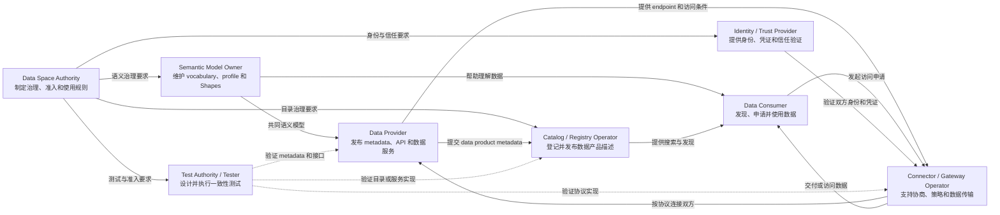
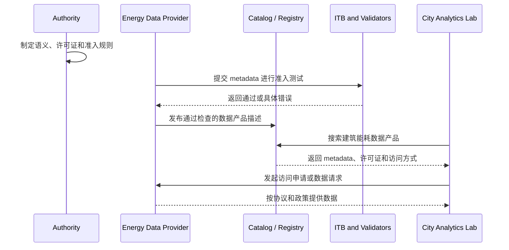
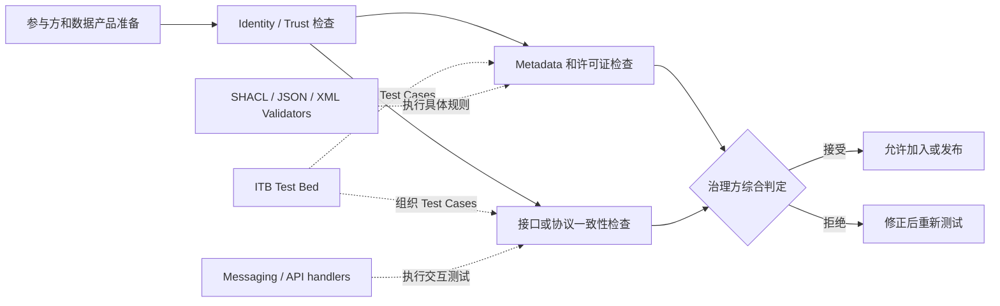
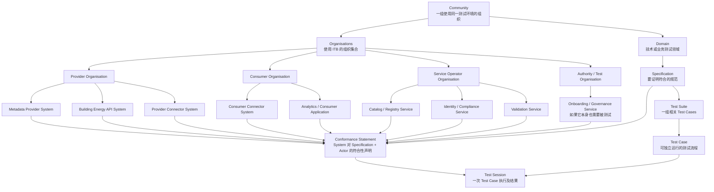
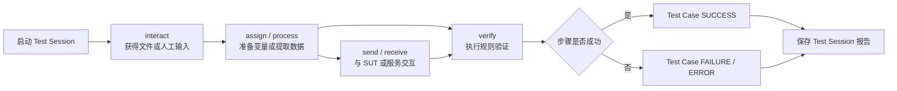
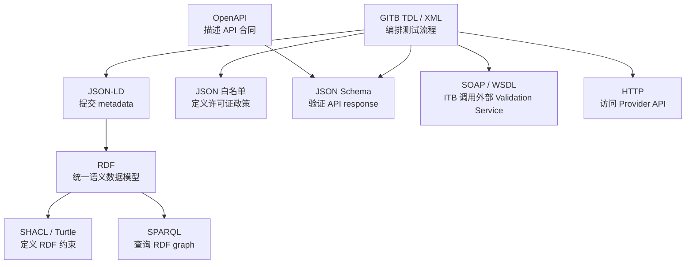
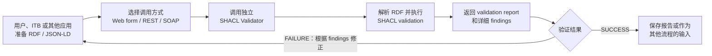
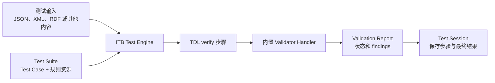
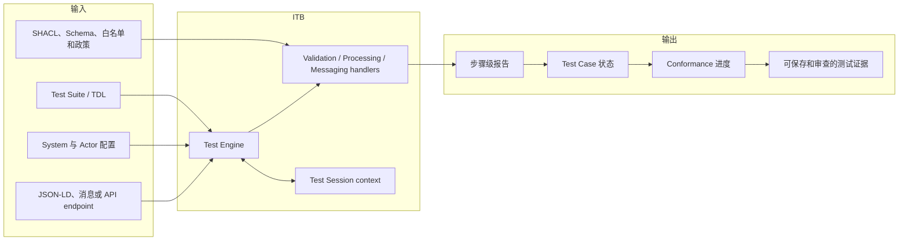

# D ITB Overview

## 1. Data Space 是什么

### 1.1 基本概念

Data Space（数据空间）不是一个集中存放所有数据的大型数据库，也不只是一个数据交易网站。它是一套让多个独立组织能够在共同规则下发现、协商、访问和使用数据的协作环境。

各参与方通常仍然保存和控制自己的数据。数据是否开放、提供给谁、允许怎样使用，由数据拥有方和 Data Space 的治理规则共同决定。因此，Data Space 强调：

- 数据主权：Provider 保留对数据访问和使用条件的控制；
- 互操作性：不同组织的系统能够交换并理解数据；
- 信任：参与方身份、凭证和政策可以被验证；
- 共同语义：各方对 Dataset、License、Unit、Time、Location 等概念有一致理解；
- 治理：参与者按照共同制定的规则加入和使用 Data Space；
- 可审计性：重要操作和合规结果能够被记录和复查。


### 1.2 Data Space 中有哪些角色

Data Space 没有一套适用于所有项目的固定角色名单，但通常会出现以下角色：

| 角色 | 主要工作 | 主要需求 |
|---|---|---|
| Data Provider | 发布数据产品、描述 metadata、提供 API 或数据服务 | 保持数据主权；声明访问条件；证明自己的 metadata 和接口合规 |
| Data Consumer | 发现数据产品、理解内容和条件、申请并使用数据 | 能搜索和比较数据；确认数据含义、质量、许可证和访问方式 |
| Data Space Authority | 制定成员、语义、技术、许可证和准入规则 | 将规则变成可执行、可审计的治理过程 |
| Catalog / Registry Operator | 保存数据产品描述、模型、凭证或可信资料 | 保证信息可发现、可查询、可追踪版本 |
| Identity / Trust Provider | 提供身份、证书、密钥或可信凭证能力 | 证明参与者和服务身份，降低冒用风险 |
| Connector / Gateway Operator | 支持协商、策略执行和数据传输 | 让异构系统能够按照协议安全交换数据 |
| Semantic Model Owner | 定义和维护 vocabulary、ontology、application profile、SHACL Shapes | 让不同参与方对字段和业务概念有一致理解 |
| Test Authority / Tester | 设计、执行和审查一致性测试 | 获得可复现的通过、失败和错误证据 |

同一个组织可以同时承担多个角色。例如 Data Space Authority 可能同时管理 Catalog、语义模型和测试平台。

### 1.3 Data Space 的常见结构

一个 Data Space 通常可以从治理、信任、语义、发现与交易、数据交换、测试与监控几个方面理解。这些方面不一定对应固定的软件产品，但代表了必须被满足的功能需求。



Authority 负责规则，Semantic Model Owner 提供共同语义，Identity / Trust Provider 建立信任，Catalog / Registry Operator 支持发现，Connector / Gateway Operator 支持协商和交换，Test Authority / Tester 负责验证，Provider 和 Consumer 完成数据供给与使用。

### 1.4 统一场景中的角色

本项目使用 Building Energy Consumption Data Product 作为统一场景：

| 场景角色 | 名称 | 任务 |
|---|---|---|
| Provider | Energy Data Provider Ltd. | 发布建筑小时级用电数据产品和 JSON-LD metadata |
| Consumer | City Analytics Lab | 发现数据产品并申请访问，用于城市能耗分析 |
| Authority | City Energy Data Space Authority | 制定 metadata、许可证和准入规则 |



当前 D 组实现的是图中的准入测试环节。

## 2. ITB 在 Data Space 中的角色

### 2.1 什么是 ITB

ITB（Interoperability Test Bed）是欧盟委员会提供的开源测试平台，用于组织和执行 conformance testing（一致性测试）及 interoperability testing（互操作性测试）。

ITB 的重点不是保存或交换业务数据，而是回答：

> 某个系统、消息、metadata、API 或业务流程是否正确实现了指定规范？

它能够把技术规范转化为 Test Suite 和 Test Case，模拟测试参与方，调用验证工具，保存每一步的结果，并形成可审查的 Test Session。

### 2.2 ITB 满足哪些角色的需求

| Data Space 角色 | 对 ITB 的需求 | ITB 提供的能力 |
|---|---|---|
| Authority | 把准入规则变成统一测试，而不是人工判断 | Specification、Test Suite、Test Case 和测试报告 |
| Provider | 在正式发布前发现 metadata、API 或协议实现错误 | 可重复执行的正向和反向测试、详细错误信息 |
| Consumer | 希望发现的数据产品至少经过基本技术检查 | 可作为准入证据的 Test Session 结果 |
| Semantic Model Owner | 确认参与方提交的数据符合共享模型 | 在 Test Case 中调用 SHACL Validator |
| Connector Developer | 检查消息格式、状态流程和端点行为 | Messaging handler、模拟 Actor、多步骤测试 |
| Test Authority / Auditor | 统一执行、保存和复查测试结果 | 用户管理、测试历史、步骤报告和导出报告 |

### 2.3 Onboarding 流程与 ITB 的作用

Onboarding 是参与方或数据产品加入 Data Space 的过程。它通常同时包含身份、法律、语义、接口和技术实现等多类检查。ITB 适合承载其中可以被明确写成测试步骤的部分。



ITB 可以提供重要的技术符合性证据，但 ITB 测试通过不等于整个参与方在法律、安全、身份、数据质量等方面全部合规。最终准入仍由 Data Space 的治理政策决定。

### 2.4 Conformance 与 Interoperability 的区别

| 类型 | 核心问题 | 示例 |
|---|---|---|
| Conformance testing | 单个实现是否符合一份规范 | JSON-LD 是否满足 SHACL；API response 是否满足 JSON Schema |
| Interoperability testing | 两个或多个实现能否正确协作 | Provider Connector 和 Consumer Connector 能否完成协商及传输 |

D 组当前的 TC01 和 TC02 主要属于 conformance testing。未来 TC03 对真实 Provider API 发起请求后，会增加接口层面的互操作行为检查，但仍不等于完整 Connector-to-Connector interoperability test。

## 3. ITB 内部结构与 Data Space 概念映射

### 3.1 核心概念

| ITB 概念 | 含义 | 在 Data Space 中可对应什么 |
|---|---|---|
| Community | 共享同一 ITB 环境和测试配置的用户范围 | 一个 Data Space、联盟或测试计划的参与组织集合 |
| Domain | 对规范和测试进行分类的领域 | Energy Data Space、Connector Protocol、Metadata Validation |
| Specification | 被测系统声明要符合的规范 | Building Energy Metadata Profile、Dataspace Protocol、OpenAPI contract |
| Organisation | 使用 ITB 的组织账户 | Provider 公司、Connector 开发商、成员机构 |
| System | Organisation 注册的具体被测系统 | Provider metadata submission、Connector、API service |
| Actor | Test Suite 中参与测试的角色定义 | Provider、Consumer、Gateway、Authority 等测试角色 |
| SUT | 真正接受测试的 Actor | Provider System、Connector 或 API |
| Conformance Statement | System 声明以某个 Actor 身份符合某项 Specification | Provider 声明其数据产品符合 Energy Metadata Profile |
| Test Suite | 覆盖一项规范的 Test Case 集合 | Metadata、许可证和 API 准入测试集合 |
| Test Case | 一条具体、可执行的测试流程 | 检查 metadata 字段；检查许可证；访问 API 并验证 response |
| Test Session | 一次实际执行及其上下文和结果 | 某个 Provider 某次上传文件的测试记录 |
| Validation Service | 接收内容并返回标准验证报告的服务 | SHACL、JSON Schema、XML 或自定义政策 Validator |

这些映射是理解方式，不是强制的一一对应关系。例如一个 Data Space 可以使用多个 ITB Domain，也可以在同一个 Domain 中管理多个 Specification。

### 3.2 ITB 管理结构

ITB 把测试对象、规范和执行结果组织成层级结构：



图中 Organisation 是使用 ITB 的组织账户范围，System 是该组织登记的具体被测实现。一个 Provider Organisation 可以同时登记 metadata provider、API 和 Connector；一个服务运营组织也可以登记 Catalog、Identity / Compliance Service 或 Validation Service。并不是图中的所有 System 都必须存在，实际登记内容取决于当前要测试的 Specification。

### 3.3 ITB 不固定业务 Actor 名称

ITB 规定 Actor 的技术概念，但不会强制所有项目使用同一组业务角色名称。Actor 的名称和职责由 Test Suite 作者根据被测规范定义。

当前 D 组 Test Suite 定义：

| Test Suite Actor | ITB 类型 | 对应的 Data Space 概念 |
|---|---|---|
| `Provider` / Energy Data Provider | SUT | 提交建筑能耗 metadata、许可证和 endpoint 的数据提供方 |
| `Authority` / City Energy Data Space Authority | Simulated | 制定 metadata profile 和许可证政策的治理方 |
| `Validator` / ITB Validation Engine | Simulated | 执行 SHACL、策略和结构检查的测试环境 |
| `Gateway` / Data Space Gateway | Simulated | TC03 中代表 Catalog、Gateway 或 Connector 一侧调用 Provider API |

Consumer 没有出现在当前三个 Test Case 中，因为当前测试目标是 Provider onboarding，而不是 Consumer 发现和消费数据的全过程。未来设计 Connector 互操作性 Test Case 时，可以增加 Consumer Actor。

## 4. Test Suite、Test Case 与 GITB TDL

### 4.1 Test Suite

Test Suite 是面向某项 Specification 的测试集合。它通常以 ZIP 上传到 ITB，ZIP 根目录包含 `testSuite.xml`，并引用一个或多个 Test Case。

当前 D 组正式套件是 Building Energy Data Product Onboarding Suite `3.2.0`，包含：

| Test Case | 目标 |
|---|---|
| TC01 Metadata Field Validation | 使用 SHACL 检查 JSON-LD metadata |
| TC02 Licence Policy Validation | 提取 `dct:license` 并检查白名单 |
| TC03 API Endpoint and Response Validation | 访问 endpoint，检查 HTTP 和 JSON response |

### 4.2 Test Case

Test Case 是 ITB 中可以独立启动的一条测试流程。它不是一条单独的 SHACL 规则，而是可以包含输入、消息交换、数据处理、验证和输出的完整步骤序列。



### 4.3 GITB TDL 是什么

GITB Test Description Language（TDL）是 ITB 用来描述 Test Suite 和 Test Case 的 XML 语言。它负责表达“测试怎么执行”，而 SHACL、JSON Schema 等语言负责表达“数据必须满足什么规则”。

TDL 文件使用 GITB 的 XML namespace，例如：

```xml
xmlns="http://www.gitb.com/tdl/v1/"
xmlns:gitb="http://www.gitb.com/core/v1/"
```

常用 TDL 构造包括：

| TDL 构造 | 作用 | 当前项目示例 |
|---|---|---|
| `<interact>` | 从测试人员获得输入 | 上传 JSON-LD metadata |
| `<assign>` | 创建变量或转换数据 | 把上传内容转换成字符串、保存 SPARQL query |
| `<process>` | 调用 processing handler | 使用 RdfUtils、JsonPathProcessor、CollectionUtils |
| `<verify>` | 调用 validator 并判断结果 | SOAP SHACL Validator、NumberValidator、JsonValidator |
| `<send>` | 通过 messaging handler 发送消息 | TC03 使用 HttpMessagingV2 请求 Provider API |
| `<output>` | 定义 Test Case 成功或失败提示 | 输出 metadata 或许可证检查结论 |

TDL 还支持 `receive`、`listen`、条件、循环、并行 flow、scriptlet 调用等结构，适合描述比单文件验证更复杂的协议和交互测试。

### 4.4 TDL 与其他语法的分工



它们不是相互替代的语言：TDL 负责控制流程；JSON-LD 和 RDF 表示数据；SHACL 与 JSON Schema定义约束；SPARQL提取语义数据；SOAP 和 HTTP 负责服务调用。

## 5. Validator 与 ITB 可用工具

### 5.1 Validator 是什么

Validator 是执行某一类规则检查的工具。它通常接收待验证内容和规则，返回是否符合以及具体 findings。

ITB 比单独 Validator 多了一层测试组织能力：一个 Test Case 可以在调用 Validator 前后执行数据提取、接口请求、条件判断和多步骤检查。

Validator 可以作为独立服务部署，也可以由 ITB 通过内置 Handler 直接使用。两种方式的区别主要在于 Validator 是否拥有独立进程、独立 API 和独立配置，而不是验证规则本身是否不同。

### 5.2 Validator 有哪些

Validator 可以按照被检查的对象和规则类型分类：

| Validator 类型 | 主要检查内容 | 典型工具或规则 | 适用需求 |
|---|---|---|---|
| RDF / Semantic Validator | RDF graph 是否满足语义和结构约束 | SHACL Validator | 检查 JSON-LD、Turtle 或 RDF metadata |
| JSON Validator | JSON 是否满足规定结构、类型和必填要求 | JSON Schema Validator | 检查 API response 或配置文件 |
| XML Validator | XML 是否满足结构和业务约束 | XSD、Schematron Validator | 可用于 XML 消息或 Credential 测试 |
| Value Validator | 数字、字符串、布尔值或格式是否符合预期 | Number、String、RegExp、Expression Validator | 检查数量、状态码、Content-Type 或表达式结果 |
| Policy Validator | 输入是否满足项目治理政策 | 白名单、黑名单、表达式或自定义规则 | 检查许可证、允许值或准入政策 |
| Custom Validation Service | 项目专用或复杂规则 | GITB Validation Service API | 可将外部合规服务接入 `<verify>` |

一个 Test Case 可以组合多个 Validator，例如依次检查 HTTP status、Content-Type 和 response body，使一条测试流程同时覆盖多个层面的约束。

### 5.3 独立 SHACL Validator

独立 SHACL Validator 是与 ITB Test Engine 分开运行的验证服务。它有自己的进程、配置目录、网络地址和版本，可以被人工用户、ITB 或其他应用共同调用。

它通常可以通过三种 channel 使用：

| Channel | 用途 |
|---|---|
| Web form | 人工上传 RDF / JSON-LD 并查看报告 |
| REST API | 其他应用通过 HTTP 调用验证 |
| SOAP API | 作为 GITB Validation Service 被 ITB `<verify>` 步骤调用 |

独立 Validator 的使用过程可以形成“验证、查看结果、修正、重新提交”的环状流程：



独立部署的好处是同一个 Validator 可以同时服务人工验证、其他应用的 REST 调用和 ITB 的 SOAP 测试步骤。它的生命周期和 ITB 分开管理，因此也需要单独关注服务可用性、版本、网络地址和配置同步。

### 5.4 正常部署 Validator

本文将 Validator 作为 ITB 内部能力直接使用的方式称为正常部署或内置使用方式。在这种结构中，不需要为 Validator 单独部署容器、网页和远程 API；Test Case 通过 Validator Handler 直接执行检查。

正常流程是：Test Suite 提供测试步骤和规则资源，Test Engine 运行 `<verify>`，内置 Validator Handler 完成验证，然后把标准 validation report 返回给 Test Session。



这种方式结构更简单，适合 ITB 已经提供对应 Handler 的常见验证需求。独立 Validator 则更适合需要独立网页、REST / SOAP API、跨系统共享或单独扩展和运维的情况。

### 5.5 Handler 的概念

Handler 是 TDL 测试步骤背后的可执行实现。TDL 描述“要执行哪一步”，Handler 负责真正完成该步骤。

例如：

```xml
<verify handler="NumberValidator">
```

表示 TDL 定义了一个验证步骤，而 `NumberValidator` 是负责执行数字比较的 Handler。

Handler 主要分为三类：

| Handler 类型 | 对应的 TDL 步骤 | 作用 |
|---|---|---|
| Validation Handler | `<verify>` | 检查输入并返回 validation report |
| Processing Handler | `<process>` | 查询、转换、提取或计算数据，返回处理结果 |
| Messaging Handler | `<send>`、`<receive>`、`<listen>` | 与 SUT 或外部系统交换消息 |

Handler 可以是 ITB 内置实现，也可以是外部 GITB Service。当前 TC01 在 `<verify>` 中把 SOAP WSDL 地址作为 Handler，表示验证工作由外部 SHACL Validator 完成；TC02 则直接引用 ITB 内置 Handler 名称。

Handler 与其他概念的区别是：

- Test Case 定义完整测试流程；
- Test Step 定义流程中的一个动作；
- Handler 执行这个动作；
- Validator 是专门负责“检查是否符合规则”的 Validation Handler 或外部 Validation Service；
- Actor 表示参与测试的系统角色，不是执行测试步骤的工具。

### 5.6 Handler 有哪些

当前 D 组 Test Suite 使用或预留的 Handler 包括：

| Handler / 工具 | 类型 | 满足的需求 |
|---|---|---|
| External SHACL Validator SOAP service | Validation | 验证 RDF / JSON-LD 是否满足 D 组 SHACL Shapes |
| `RdfUtils` | Processing | 解析 RDF，并执行 SPARQL 查询 |
| `JsonPathProcessor` | Processing | 从 SPARQL JSON 或普通 JSON 中提取值 |
| `CollectionUtils` | Processing | 统计列表、查找值、判断白名单成员 |
| `NumberValidator` | Validation | 检查许可证数量、endpoint 数量和 HTTP status |
| `ExpressionValidator` | Validation | 判断布尔表达式或政策匹配结果 |
| `HttpMessagingV2` | Messaging | 向 Provider endpoint 发送 HTTP 请求 |
| `RegExpValidator` | Validation | 检查 `Content-Type` 等文本格式 |
| `JsonValidator` | Validation | 按 JSON Schema 验证 API response |

ITB 还可以根据其他测试需求使用或接入：

| Handler / 服务 | 适用场景 |
|---|---|
| XML / XSD Validator | 检查 XML 文档结构 |
| Schematron Validator | 检查 XML 业务规则和节点关系 |
| StringValidator | 检查两个字符串或固定文本是否一致 |
| XPath / JSONPath Processor | 从结构化文档中定位并提取字段 |
| Custom Validation Service | 执行项目专用合规规则 |
| Custom Processing Service | 执行转换、签名处理、数据归一化等操作 |
| Custom Messaging Service | 支持标准 Handler 没有覆盖的协议或消息系统 |

Handler 列表不是固定封闭的。只要实现相应 GITB Validation、Processing 或 Messaging Service API，就可以将新的工具接入 Test Case。

## 6. ITB 的输入、处理与输出概览



ITB 的价值不只是给出一个 true 或 false，而是把测试对象、规范、执行步骤、错误原因和历史记录组织在同一个测试框架中。


## References

1. European Commission, Interoperability Test Bed overview: <https://www.itb.ec.europa.eu/docs/guides/latest/overview/>
2. European Commission, Getting started with the Test Bed: <https://www.itb.ec.europa.eu/docs/guides/latest/onboardingDevelopers/>
3. European Commission, GITB Test Description Language: <https://www.itb.ec.europa.eu/docs/tdl/latest/>
4. European Commission, GITB Test Suite documentation: <https://www.itb.ec.europa.eu/docs/tdl/latest/testsuite/>
5. European Commission, GITB Test Case documentation: <https://www.itb.ec.europa.eu/docs/tdl/latest/testcase/>
6. European Commission, GITB Test Step Handlers: <https://www.itb.ec.europa.eu/docs/tdl/latest/handlers/>
7. European Commission, GITB Validation Service API: <https://www.itb.ec.europa.eu/docs/services/latest/validation/>
8. European Commission, RDF and SHACL validation guide: <https://www.itb.ec.europa.eu/docs/guides/latest/validatingRDF/>
9. ISAITB, SHACL Validator source repository: <https://github.com/ISAITB/shacl-validator>
10. W3C, RDF 1.1 Concepts and Abstract Syntax: <https://www.w3.org/TR/rdf11-concepts/>
11. W3C, JSON-LD 1.1: <https://www.w3.org/TR/json-ld11/>
12. W3C, Shapes Constraint Language (SHACL): <https://www.w3.org/TR/shacl/>
13. W3C, SPARQL 1.1 Query Language: <https://www.w3.org/TR/sparql11-query/>
14. W3C, Data Catalog Vocabulary (DCAT) 3: <https://www.w3.org/TR/vocab-dcat-3/>
15. Dublin Core Metadata Initiative, DCMI Metadata Terms: <https://www.dublincore.org/specifications/dublin-core/dcmi-terms/>
16. Data Spaces Support Centre, Data Spaces Blueprint: <https://dssc.eu/space/BVE2/1071251457/Data+Spaces+Blueprint+v2.0+-+Home>
