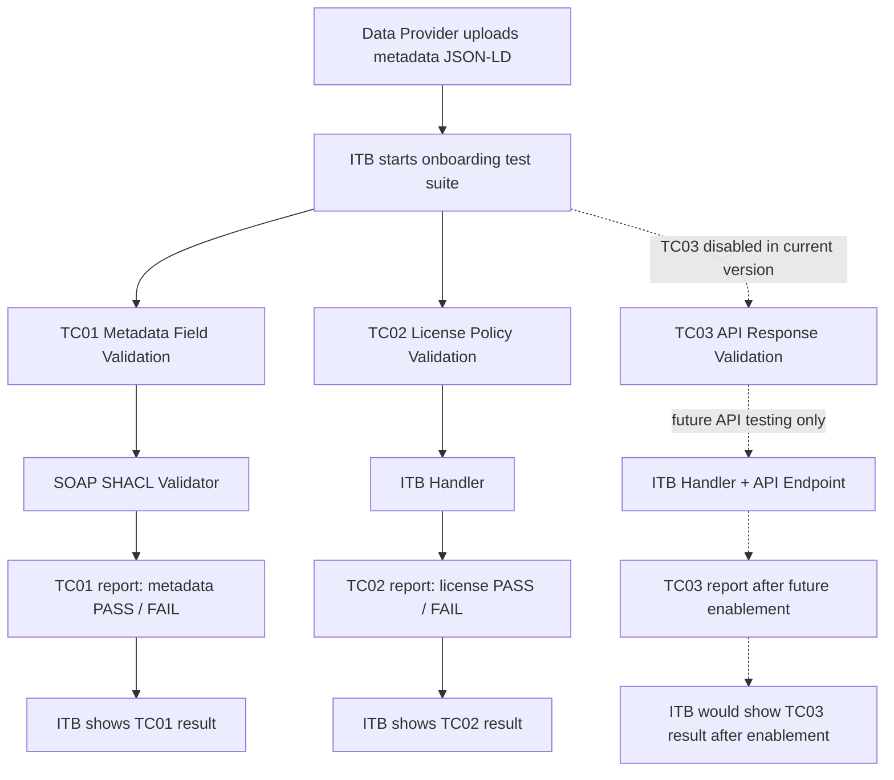

# D 组 Test Suite Design

## 1. 设计目标与规则展开

### 1.1 设计目标

本 test suite 将 D 组 `building-energy-shapes_D.ttl` 中的建筑能耗数据产品 metadata 规则，转化为 ITB 中可组织、可执行、可演示的 conformance test cases。

- 使用 TTL 验证 metadata 字段；
- 从 metadata 中展开 license 和 API validation；
- 通过 ITB 输出 onboarding 测试报告；
- 使用 samples 演示不同输入的预期效果。

### 1.2 从 Resources 到 Test Case

| 规则来源 | 检查含义 | Test Case |
|---|---|---|
| `building-energy-shapes_D.ttl` 中的必填字段、类型、枚举、时间约束、ClosedShape | metadata profile 合规性 | `TC01_METADATA_FIELD_VALIDATION` |
| TTL 中的 `dct:license` 字段 + Authority whitelist | license 是否声明、格式是否正确、是否被允许 | `TC02_LICENSE_POLICY_VALIDATION` |
| metadata 中的 endpoint 信息 + OpenAPI / JSON Schema | API endpoint / response 是否符合接口约定 | `TC03_API_RESPONSE_VALIDATION` |


### 1.3 结果状态处理

| 状态 | 含义 | 当前处理方式 |
|---|---|---|
| `pass` | 输入符合规则 | ITB 显示 `PASS` |
| `fail` | 输入可测试，但违反规则 | ITB 显示 `FAILURE` |
| `inapplicable` | 输入可测试，但包含 TTL / schema 未声明的额外字段 | 通过 `sh:Violation` 或 schema violation 映射为 `FAILURE` |
| `untestable` | 因文件无法解析、validator 不可用、超时或环境故障导致无法测试 | 在 ITB 中表现为执行错误、失败或无法完成验证 |

当前 ITB 报告主要显示 `PASS` / `FAILURE`。`inapplicable` 和 `untestable` 是业务解释，不是单独的 ITB 状态：前者会被映射为 `FAILURE`，后者通常表现为测试执行错误或无法完成。具体原因需要查看validator report。

## 2. Test Suite 总体结构

### 2.1 文件结构

当前 `testsuite/` 的结构如下。上传到 ITB 的 ZIP 根目录应直接包含 `testSuite.xml`、`testCases/` 和 `Resources/`。

```text
testsuite/
├── testSuite.xml
├── testCases/
│   ├── TC01_METADATA_FIELD_VALIDATION.xml
│   ├── TC02_LICENSE_POLICY_VALIDATION.xml
│   └── TC03_API_RESPONSE_VALIDATION.xml
├── Resources/
│   ├── api-response.schema.json
│   ├── building-energy-shapes_D.ttl
│   ├── license-whitelist.json
│   └── openapi.yaml
└── Samples/
    ├── mock-api/
    │   ├── api-response-valid.json
    │   └── api-response-invalid.json
    ├── data-product-api-local-invalid-response.jsonld
    ├── data-product-api-local-test.jsonld
    ├── data-product-invalid.jsonld
    ├── data-product-license-disallowed.jsonld
    ├── data-product-license-missing.jsonld
    └── data-product-valid.jsonld
```

### 2.2 Actors and Roles

| Actor | ITB 角色 | Data Space 含义 | 作用 |
|---|---|---|---|
| `Provider` | SUT | Energy Data Provider | 被测试对象，提交 metadata |
| `Authority` | Simulated Actor | Governance authority | 定义 TTL、license whitelist、API contract |
| `Validator` | Simulated Actor / Validation Engine | Validation component | 执行 metadata、license、API 检查 |
| `Gateway` | Simulated Actor | Data space gateway / connector | 用于 API endpoint 调用场景 |

`Provider` 是唯一真正被测试的 SUT；其他 actor 用于表达治理、验证和 API 访问流程。


### 2.3 Test Cases Overview

| Test Case | 输入 | 规则来源 | Validator / Handler | 输出 |
|---|---|---|---|---|
| `TC01_METADATA_FIELD_VALIDATION` | metadata JSON-LD | `building-energy-shapes_D.ttl` | 独立 SHACL Validator + SOAP API | PASS / FAIL |
| `TC02_LICENSE_POLICY_VALIDATION` | metadata JSON-LD | `dct:license` + `license-whitelist.json` | ITB handler | PASS / FAIL |
| `TC03_API_RESPONSE_VALIDATION` | metadata JSON-LD / endpoint response | `openapi.yaml` + `api-response.schema.json` | ITB handler | 当前禁用，启用后 PASS / FAIL |


### 2.4 总体执行流程

正式 onboarding 的核心输入是 data product metadata。license 和 endpoint 应从 metadata 中提取，再触发后续检查。



## 3. Test Case 设计

### 3.1 TC01 Metadata Field Validation

TC01 验证 metadata JSON-LD 是否符合 D 组 TTL。

| 项目 | 内容 |
|---|---|
| 输入 | metadata JSON-LD |
| 执行 | ITB 通过 `verify` 调用 SHACL Validator |
| 规则 | `building-energy-shapes_D.ttl` |
| 输出 | SHACL report + ITB PASS / FAILURE |

主要检查：

- 必填字段是否存在；
- 字段类型和枚举值是否合规；
- 时间字段是否符合逻辑顺序；
- endpoint / format 等字段是否符合约束；
- profile 外字段是否被 ClosedShape 拒绝。


### 3.2 TC02 License Policy Validation

TC02 检查 metadata 中声明的 license 是否符合 Authority policy。license 从 metadata 中提取，不单独上传，使用 ITB handler 完成检查。

设计流程：

1. 上传 metadata JSON-LD；
2. 从 metadata 中提取 `dct:license`；
3. 检查 license 是否存在且为 IRI；
4. 读取 `license-whitelist.json` 中的允许列表；
5. license 在白名单内则 PASS，否则 FAIL。

| 规则来源 | 作用 |
|---|---|
| `building-energy-shapes_D.ttl` | 检查 license 字段基本格式 |
| `license-whitelist.json` | 定义 Authority 允许的 license 列表 |
| TC02 XML 中的 ITB handler | 执行 license 提取和白名单判断 |


### 3.3 TC03 API Response Validation

TC03 用于检查 metadata 中声明的 API endpoint 及其 response 是否符合 API contract，使用 ITB handler 提取 endpoint、调用 API。当前版本由于没有真实 API endpoint，TC03 设为禁用；XML 中保留的是后续真实 API conformance testing 的设计逻辑。

设计流程：

1. 上传 metadata JSON-LD；
2. 从 metadata 中提取 `dcat:endpointURL`；
3. 调用 endpoint；
4. 检查 HTTP status 和 `Content-Type`；
5. 使用 `api-response.schema.json` 检查 response body；
6. endpoint 可访问且 response 合规则 PASS，否则 FAIL。

| 规则来源 | 作用 |
|---|---|
| `building-energy-shapes_D.ttl` | 检查 metadata 中 endpoint 声明 |
| `openapi.yaml` | 描述 API contract |
| `api-response.schema.json` | 执行 JSON response 检查 |


## 4. Validator 接入方式

### 4.1 独立 SHACL Validator + SOAP API

独立部署方式是把官方 SHACL Validator 作为单独服务运行，再让 ITB 通过 SOAP API 调用它。

这种方式下，TTL 不由 ITB 直接解析，而是放在 validator 配置目录中。Validator 根据 `validationType=v1` 加载对应 TTL：

```text
validator-config/
└── energy/
    ├── config.properties
    └── shapes/
        └── building-energy-shapes_D.ttl
```

在 test case 中，ITB 的 `verify` step 使用 SOAP WSDL 地址作为 handler，并传入 metadata、content syntax 和 validation type。

该方式适合 TC01，因为 SHACL / RDF / JSON-LD 验证由官方 validator 处理，规则集中在 TTL 和 validator config 中。代价是需要额外部署 validator 容器，并保证 ITB 容器可以访问 SOAP 地址。

### 4.2 ITB 内置 Handler

ITB 内置方式是直接使用 test engine 支持的 handler。规则文件通常放在 `testsuite/Resources/` 中，由 test case import 或作为参数引用。

当前设计涉及的 handler / TDL 能力包括：

| Handler | 作用 | 用在本 test suite 中的含义 |
|---|---|---|
| `RdfUtils` | 处理 RDF / JSON-LD，并执行 SPARQL 查询 | 从 metadata JSON-LD 中按 RDF 语义提取 `dct:license` 或 `dcat:endpointURL` |
| `JsonPathProcessor` | 从 JSON 内容中按 JsonPath 表达式读取值 | 从 SPARQL result 中取出 license value，或读取 `license-whitelist.json` 中的允许列表 |
| `CollectionUtils` | 对 list / collection 做判断 | 统计 license 数量，或判断提取出的 license 是否在 whitelist 中 |
| `ExpressionValidator` | 验证布尔表达式是否成立 | 将 whitelist membership 结果转换为 TC02 的 PASS / FAIL |
| `HttpMessagingV2` | 发送 HTTP 请求并接收 response | TC03 启用后，用于调用 metadata 中声明的 API endpoint |
| `JsonValidator` | 使用 JSON Schema 验证 JSON 内容 | TC03 启用后，用 `api-response.schema.json` 检查 API response |

TC02 使用 ITB handler 从 JSON-LD 中提取 license，并与 `license-whitelist.json` 比对。TC03 当前禁用；后续启用时，设计上会使用 ITB handler 提取 endpoint、调用 API，并用 `api-response.schema.json` 检查 response。

该方式不需要额外部署 validator，适合 license policy、HTTP 调用、JSON Schema 等轻量检查。主要风险是目标 ITB 环境必须支持对应 handler；如果 handler 不存在，test suite 会在上传或运行时报错。

### 4.3 两种方式对比

| 维度 | 独立 SHACL Validator + SOAP API | ITB 内置 Handler |
|---|---|---|
| 是否额外部署 | 需要 | 不需要 |
| 适合对象 | SHACL metadata validation | license policy、HTTP、JSON Schema |
| 规则位置 | `validator-config/energy/shapes/` | `testsuite/Resources/` 或 test case XML |
| 当前用途 | TC01 | TC02；TC03 保留但禁用 |
| 主要风险 | 网络和部署配置 | handler 是否被目标 ITB 支持 |

当前实现中，TC01 使用独立 SHACL Validator + SOAP API；TC02 使用 ITB handler；TC03 因没有真实 API 暂时禁用。

## 5. Samples 设计与使用

Samples 仅用于 demo 和人工 review，不代表完整测试覆盖。正式 onboarding 时应上传实际 metadata。

### 5.1 Metadata Samples

| Sample | 用途 | 预期效果 |
|---|---|---|
| `data-product-valid.jsonld` | 合规 metadata 示例 | TC01 PASS |
| `data-product-invalid.jsonld` | 不合规 metadata 示例 | TC01 FAIL |
| `metadata-invalid-http-endpoint.jsonld` | 基于 valid，仅将 endpoint 从 HTTPS 改为 HTTP | TC01 FAIL |

### 5.2 License Samples

| Sample | 用途 | 预期效果 |
|---|---|---|
| `data-product-valid.jsonld` | license 在白名单内 | TC02 PASS |
| `data-product-license-disallowed.jsonld` | license 不在 whitelist | TC02 FAIL |
| `data-product-license-missing.jsonld` | 缺少 license | TC02 FAIL |
| `data-product-invalid.jsonld` | 可复用为缺少 license 的失败样例 | TC02 FAIL |


### 5.3 API Samples

TC03 当前禁用，因此 API samples 只用于说明后续启用真实 API 检查时的预期效果。

| Sample | 用途 | Mock response | 预期效果 |
|---|---|---|---|
| `data-product-api-local-test.jsonld` | metadata 中的 endpoint 指向 mock valid response | `mock-api/api-response-valid.json` | TC03 PASS |
| `data-product-api-local-invalid-response.jsonld` | metadata 中的 endpoint 指向 mock invalid response | `mock-api/api-response-invalid.json` | TC03 FAIL |

`mock-api/api-response-valid.json` 和 `mock-api/api-response-invalid.json` 不作为上传文件使用；它们由本地 mock API 服务返回，并由 TC03 使用 `Resources/api-response.schema.json` 校验。


