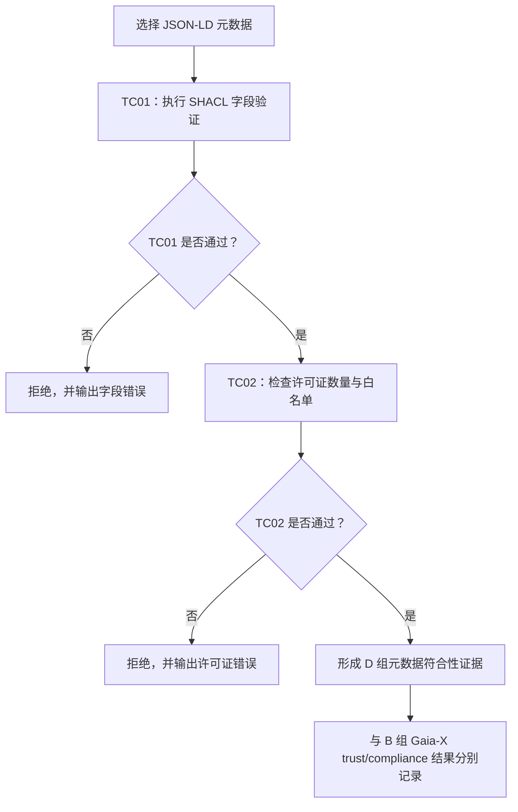

# 交付 B 组：数据产品元数据验证材料

## 1. 交付目的

本目录由 D 组提供给 B 组，用于证明建筑能耗数据产品的元数据已经经过以下两类检查：

1. **TC01：元数据字段与 SHACL 规则检查**；
2. **TC02：许可证声明与白名单策略检查**。

B 组可将通过的报告作为 onboarding 流程中的 **metadata semantic conformance evidence（元数据语义符合性证据）**，并将未通过的报告用于展示拒绝路径和具体错误原因。

> [!IMPORTANT]
> 本目录证明的是“数据产品元数据是否符合 D 组的语义和许可证规则”，不代表 Gaia-X participant、ServiceOffering 或 VP-JWT 已经通过 B 组负责的 trust/compliance 检查。两类结果必须分别保存和展示。

## 2. 快速查看

如果只想快速确认交付结果，请按下面的顺序查看：

1. 打开 [`metadata/data-product-valid.jsonld`](metadata/data-product-valid.jsonld)，查看正确元数据样例；
2. 打开 [`validation-reports/valid_TC01.pdf`](validation-reports/valid_TC01.pdf)，确认 SHACL 字段检查结果为 `SUCCESS`；
3. 打开 [`validation-reports/valid_TC02.pdf`](validation-reports/valid_TC02.pdf)，确认许可证策略检查结果为 `SUCCESS`；
4. 再查看两份 `Invalid` 报告，了解错误元数据为什么会被拒绝。

## 3. 目录结构

```text
交付B组/
├── README.md
├── metadata/
│   ├── data-product-valid.jsonld
│   └── data-product-invalid.jsonld
├── shacl-rules/
│   └── building-energy-shapes_D.ttl
└── validation-reports/
    ├── valid_TC01.pdf
    ├── valid_TC02.pdf
    ├── Invalid_TC01.pdf
    └── Invalid_TC02.pdf
```

## 4. 文件说明

| 文件 | 用途 |
|---|---|
| `metadata/data-product-valid.jsonld` | 正确的 JSON-LD 元数据样例；用于生成两份 `valid` 报告。 |
| `metadata/data-product-invalid.jsonld` | 故意构造的错误样例；用于验证系统能否识别并拒绝不合规元数据。 |
| `shacl-rules/building-energy-shapes_D.ttl` | D 组最终版 SHACL Shapes；报告中对应的规范名称为 `Building Energy Metadata Profile v1.1`。 |
| `validation-reports/valid_TC01.pdf` | 正确样例的 TC01 报告；SHACL 字段验证成功。 |
| `validation-reports/valid_TC02.pdf` | 正确样例的 TC02 报告；许可证数量和白名单策略验证成功。 |
| `validation-reports/Invalid_TC01.pdf` | 错误样例的 TC01 报告；正确识别出 3 项错误。 |
| `validation-reports/Invalid_TC02.pdf` | 错误样例的 TC02 报告；正确识别出许可证缺失。 |

## 5. 测试结果汇总

| 输入文件 | Test Case | 报告 | 预期结果 | 实测结果 | 主要原因 |
|---|---|---|---|---|---|
| `data-product-valid.jsonld` | TC01 元数据字段验证 | `valid_TC01.pdf` | 通过 | `SUCCESS` | 所有必填字段、类型和值均满足 SHACL 规则。 |
| `data-product-valid.jsonld` | TC02 许可证策略验证 | `valid_TC02.pdf` | 通过 | `SUCCESS` | 恰好声明一个 IRI 类型许可证，且该许可证位于 Authority 白名单中。 |
| `data-product-invalid.jsonld` | TC01 元数据字段验证 | `Invalid_TC01.pdf` | 拒绝 | `FAILURE` | `unit` 错误、缺少 `temporalEnd`、缺少 `providerName`。 |
| `data-product-invalid.jsonld` | TC02 许可证策略验证 | `Invalid_TC02.pdf` | 拒绝 | `FAILURE` | 没有声明 `dct:license`，实际数量为 0，预期数量为 1。 |

### Invalid TC01 的 3 项具体错误

1. `ex:unit` 的值为 `MWh`，规则要求精确等于 `kWh`，并区分大小写；
2. 缺少 `ex:temporalEnd`，规则要求提供一个 `xsd:date` 类型的结束日期；
3. 缺少 `ex:providerName`，规则要求提供一个非空的 `xsd:string`。

## 6. 验证流程



## 7. 主要验证规则

### 7.1 TC01：SHACL 元数据字段验证

`building-energy-shapes_D.ttl` 主要检查：

- RDF 图中必须包含且只能包含一个 `dcat:Dataset`；
- Dataset 必须使用 IRI 作为节点标识；
- 必填字段必须存在且只能出现一次；
- 字符串字段不能是空白内容；
- `frequency` 必须精确等于 `hourly`；
- `unit` 必须精确等于 `kWh`；
- `format` 必须精确等于 `application/json`；
- `endpointUrl` 必须是 HTTPS IRI；
- `temporalStart` 和 `temporalEnd` 必须为 `xsd:date`；
- 开始日期不能晚于结束日期；
- 未在 profile 中声明的多余 Dataset 属性会被 Closed Shape 拒绝。

SHACL 文件中的结果语义为：

| 结果 | 含义 |
|---|---|
| `PASS` | 已声明字段满足全部约束。 |
| `FAIL` | 字段缺失、类型错误、值不在允许范围内或日期顺序错误。 |
| `INAPPLICABLE` | 提交了 profile 未声明的多余字段；本规则将其作为 Violation 拒绝。 |
| `UNTESTABLE` | 文件无法解析、Validator 超时或基础设施故障。 |

### 7.2 TC02：许可证策略验证

TC02 是 ITB 中的独立策略检查，要求：

1. 元数据必须恰好声明一个 `dct:license`；
2. 许可证值必须是 IRI；
3. 该许可证必须存在于 Authority 白名单中。

> [!NOTE]
> SHACL 文件将 `dct:license` 定义为可选字段，只规定“如果提供，则最多一个、必须为 HTTPS IRI”。TC02 在此基础上采用更严格的业务策略，要求许可证必须存在且位于白名单中。因此，SHACL 字段验证通过不等于许可证策略也一定通过。

## 8. B 组集成时的使用方式

B 组建议执行以下核对：

- 使用 `data-product-valid.jsonld` 的 Dataset ID `building-energy-hourly-v1`，核对其是否与 ServiceOffering 引用的 Dataset ID 一致；
- 使用本 README 中的 SHA-256 值，核对集成时使用的元数据和规则文件是否与本次实测文件一致；
- 将 `valid_TC01.pdf` 保存为元数据字段符合性证据；
- 将 `valid_TC02.pdf` 保存为许可证策略符合性证据；
- 将两份 `Invalid` 报告用于展示 onboarding 拒绝路径；
- 将 D 组验证结果与 B 组 Gaia-X trust/compliance 结果分别记录，不能互相替代。

建议的最终业务判定为：

```text
B 组 Gaia-X trust/compliance 通过
AND
D 组 TC01 通过
AND
D 组 TC02 通过
= Onboarding Accepted
```

错误样例的 Dataset ID 是 `building-energy-hourly-v1-invalid`，仅用于负向测试，不应作为正式 ServiceOffering 的引用对象。

## 9. 文件完整性校验

以下 SHA-256 值对应当前交付文件：

| 文件 | SHA-256 |
|---|---|
| `data-product-invalid.jsonld` | `0ADE622953414C5F53FDC40300972C6D47C6EA6FDF28E12071F7EA6EB86F7BD2` |
| `data-product-valid.jsonld` | `045A44A3180F3781579F95B762E25C25F32A34EAD418D1863800BFBDF4728B10` |
| `building-energy-shapes_D.ttl` | `E5F150D7DBE338FCBB7B020585CC83713DE1FDB6B1A4BE393BE1BEF47895411E` |
| `Invalid_TC01.pdf` | `1EFC9CC791DD49E6D27574300809F1E45AA861304F5045A8E145F0ACC88FF7B4` |
| `Invalid_TC02.pdf` | `F00A328DB7F10F40564CB76D2BEC24C56FE50C3750D8631B46E26DFF3AA22A8F` |
| `valid_TC01.pdf` | `1B5D98E4380FEF330ACB8DE5FBE15144BF94269CEB5C947383AF87A78C33E767` |
| `valid_TC02.pdf` | `DEBAE9C0D834D4284AE277F502021F93D57F4986825231623FCFA51145FD35A9` |

在 PowerShell 中，可使用下面的命令重新计算哈希：

```powershell
Get-ChildItem -Recurse -File | Where-Object { $_.Name -ne 'README.md' } | Get-FileHash -Algorithm SHA256
```

如果任何交付文件被修改，SHA-256 值都会变化，此时需要重新验证并更新本节。

## 10. 当前交付边界

本目录目前已经包含输入元数据、SHACL 规则和可阅读的 ITB PDF 报告，但尚未包含以下信息或文件：

- ServiceOffering / Offering ID 与 Dataset ID 的正式映射；
- Validator 的明确版本号和访问 endpoint；
- 原始 SHACL 报告（例如 Turtle 或 JSON 格式）；
- ITB 原始机器可读结果（例如 JSON）；
- Validator 请求与响应记录；
- 操作截图；
- Authority 许可证白名单原文件或版本号；
- 单独的 metadata 版本字段。

如需将本目录作为正式、可复现、可审计的最终交付包，建议后续补齐上述材料。

## 11. 术语说明

| 术语 | 简单解释 |
|---|---|
| JSON-LD | 带有语义链接能力的 JSON 格式，本目录用它描述数据产品元数据。 |
| SHACL | 用于检查 RDF 数据结构和值是否满足约束的标准。 |
| Shapes | SHACL 规则集合，描述哪些字段必填、类型和值应满足什么条件。 |
| ITB | Interoperability Test Bed，用于组织、执行并导出标准化测试报告。 |
| IRI | 用于唯一标识资源的地址形式，可理解为更通用的 URI。 |
| SHA-256 | 文件指纹；用于证明被检查和被交付的是同一份文件。 |
| Conformance evidence | 符合性证据，表示某个对象经过了明确规则的检查。 |
